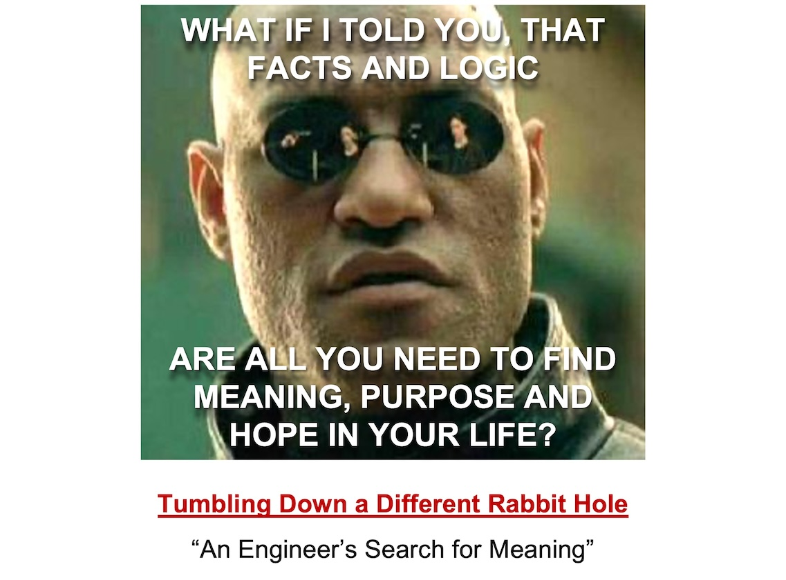

---
layout:
  title:
    visible: true
  description:
    visible: false
  tableOfContents:
    visible: true
  outline:
    visible: true
  pagination:
    visible: true
---

# Preface

<figure><figcaption></figcaption></figure>

Is it possible to answer life's hard questions of meaning and purpose by following evidence and reason alone? In other words, can this be done without taking any leaps of faith or relying on your feelings?

Can doing so satisfy our need for not just knowing the answers but knowing why those are the best available answers?

Can such an approach offer hope for the future that isn't just wishful thinking?

Can it foster widespread agreement among people worldwide by giving everyone a common and robust framework?

"An Engineer’s Search for Meaning" answers all of these questions with a resounding “yes!”

This book is an account of my own journey of meaning-seeking.&#x20;

And since I am an engineer by profession (and also at heart), I have organized all the evidence and reasoning that I have collected into a scientific framework. I am calling this framework the “Meaning-Seeking Entities (MSE) Framework”.

Note that I am not claiming to be a philosopher or an authority in any of the scientific fields discussed in this book.&#x20;

I am basically a curious person with a STEM background, who followed his passion for understanding reality from First Principles and ended up discovering amazingly strong evidence of meaning, purpose and hope in the universe.&#x20;

I am also guessing that this book is most likely to appeal to people that fit the same profile. Most other books about meaning talk about meaning in a religious or poetic sense, but that is not what I am attempting to do here.

I am not claiming that I am the first one to go down this road either. I am in the company of a string of stalwarts with far more authority than me who seem to have reached very similar conclusions as me.

Nevertheless, I believe that I have added something unique to the conversation and formulated and presented it in a novel way that I have never seen before.

The beauty of using evidence and reason as the ultimate basis for all arguments in the book is that anyone can look at the evidence by themselves, do their own reasoning and validate the arguments on their own. Who I am or what authority I have is completely irrelevant, by design.

My hope in writing this book is that people who think like me might benefit from these ideas and this type of presentation, and it may contribute towards the larger effort to tackle the “meaning crisis” that plagues our world.

There was a time when the movement of heavenly bodies or the occurrence of famines, epidemics, births and deaths were all considered to have supernatural causes beyond the reach of reason. But today, we all agree on how they occur, as well as how to deal with them, thanks to our relentless pursuit of evidence and reason via science and engineering.

So don’t let dogmatic beliefs like “meaning and purpose are beyond the scope of science” hinder you. When one pulls up their sleeves like real engineers, solving this problem becomes well within our reach.

Over the next few chapters, I hope to do exactly that.

