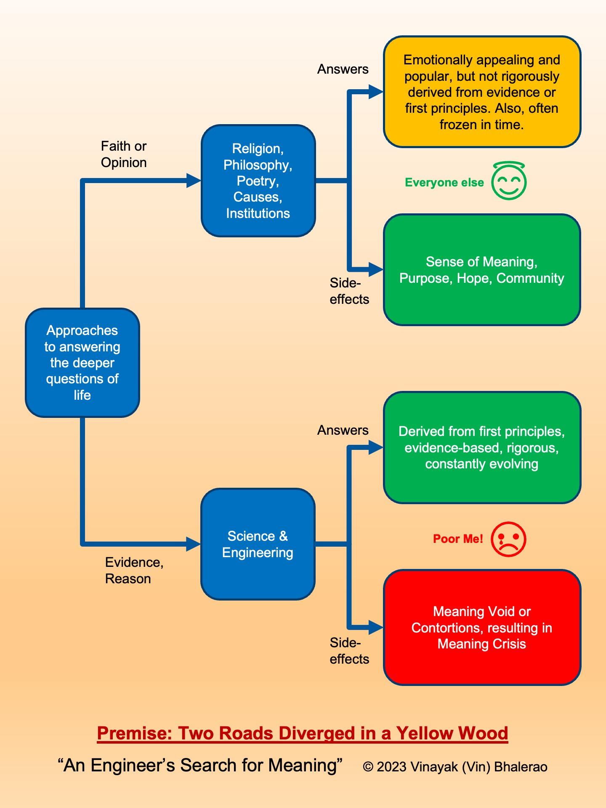

---
layout:
  title:
    visible: true
  description:
    visible: false
  tableOfContents:
    visible: true
  outline:
    visible: true
  pagination:
    visible: true
---

# 2. Premise: Two Roads Diverged in a Yellow Wood...

<figure><figcaption>
Well, not quite a yellow wood, but we'll make do with this for now
</figcaption></figure>

***

_"All the interests of my reason, speculative as well as practical, combine in the three following questions: 1. What can I know? 2. What ought I to do? 3. What may I hope?"_

**― Immanuel Kant, German philosopher, in "Critique of Pure Reason"**

_"If you are in a shipwreck and all the boats are gone, a piano top buoyant enough to keep you afloat that comes along makes a fortuitous life preserver. But this is not to say that the best way to design a life preserver is in the form of a piano top. I think that we are clinging to a great many piano tops in accepting yesterday’s fortuitous contrivings as constituting the only means for solving a given problem.”_&#x20;

**― Buckminster Fuller, American architect and systems theorist, in "Operating Manual for Spaceship Earth"**

***

## Man’s (Incomplete) Search for Meaning 

As I mentioned in the previous chapter, I really wanted to find honest, defensible answers to the questions of meaning, purpose and hope, based on rigorous stepwise analysis, all the way from the ground up. No shortcuts, no leaps of faith, no hand waving, no opinions.

But how was I going to do that?

Luckily, this quest is not uncommon at all. In fact, it might even be one of the oldest.

Since the dawn of time, in every corner of the world, scores of human beings have gone through this exercise. Time and again, people have asked fundamental questions about existence, such as:

* What is all this that surrounds us?
* What does it all mean?
* What is its purpose?
* Who am I?
* What is my purpose?
* Where is it all going?
* What can I be hopeful about?
* How can I live a good life?

Now, if you go down the street and ask a random person whether they ever think about such fundamental questions of life, the universe and everything, most will likely say that they rarely do so. (Provided they don't look at you like you were crazy and cross the street first!)

Maybe a huge number of people go through even their entire lives without ever asking these questions.

That's probably true. (I would even say it is a privilege to be able to ask such questions and think about them to any level of depth.)

But the reason why most people are able to get through their lives without having to ask these questions on a regular basis is exactly because various thinkers, holy men, lawmakers, scientists and opinion makers from the past have already done this thinking for them. Over time, their answers have been turned into structures, practices, laws, rituals, technologies and techniques based on that, which hide all this complexity from the person in the street.

We could even say that most of the progress humanity has made over the millennia has been, in large part, due to such people relentlessly asking and answering these questions, simplifying the answers, creating structures and processes based on them, and bringing them to people.

Another way of saying the same thing is that these questions and answers form the operating system of society, on top of which many apps have been built.

It's true that most people want to simply use the apps to get their stuff done. Very few want to get their hands dirty in the operating system or the hardware.

That's an engineer's job!&#x20;

Engineers don't want to just use the apps. We want to know the plumbing beneath them. We want to know how the apps work, where they came from, why these apps and not some other ones, how to develop new ones, and so on.

But I am getting ahead of myself. We will get back to talking about the special role of engineers soon enough. After all, the book is titled "An Engineer's Search for Meaning"!

Let us get back to the real world of regular people, most of whom aren't engineers.

Even for a typical person in the street, while they may not ask the deep questions of existence on a regular basis, it is not uncommon to run into such questions at certain critical times in their lives, either explicitly or implicitly.

Most people do face such questions when they have profound life experiences, such as births or deaths in the family or when diagnosed with some serious disease or when breaking up with someone or losing their job and so on. Or when they face major life decisions, such as choosing a career path or choosing a life partner or deciding to relocate, and so on.

And of course, as we have already seen, when going through midlife crises!

To summarize, while these questions look rather obscure, they have been extremely important and influential throughout history, at the societal level as well as the individual level.

Needless to say, plenty of literature is devoted to them. As a result, all I should have needed to do to find satisfying answers to these questions of meaning, purpose and hope was to simply go to the library (i.e., Google and Wikipedia) and spend a few months reading.

Well, as it turned out, it wasn’t that easy.

My insistence on answering these questions rigorously and from first principles ended up becoming a major hurdle in my own way. I didn't just want some well-worn answers, I wanted to know how those answers were arrived at and be convinced that the answers stood on firm ground.

That's not what I found in the library. Or the newspapers. Or internet. Or culture.

There were answers, for sure. Plenty of them. But none of them met my criteria.

I had to make a choice. As Robert Frost’s famous poem goes, “Two roads diverged in a wood…”

Let us first look at the well-traveled road and why it didn't work for me.

## The Well-Traveled Road: Following a Religion or a Philosophy or Dedicating Yourself to a Cause or Even an Institution 

The largest body of such thinking, with the widest and deepest range of answers, is found in religion and some of the popular philosophies. (I am combining these two categories together because when I say religion in this context, I am really referring to the philosophical underpinnings of various world religions, not their ritual and cultural aspects.)

Probably the second most popular approach, particularly among people who have left religion behind, is to dedicate oneself to some cause. These may include things like freedom, environment, justice, equality, the arts, various social problems and so on.

Alternatively, some people dedicate themselves to some institution, including their employer or the industry they are in.

On a more fundamental level, we also have the triumvirate of money, power and fame that most people, knowingly or unknowingly, dedicate themselves to.

All of these approaches can be quite emotionally, and sometimes even intellectually, appealing. They make a whole lot of sense, and can lead to happy lives.

What’s more, there usually are many readily available avenues that you can simply walk down, without having to find your own way. There are existing communities and activities that one can participate in, and they can provide a strong sense of meaning, purpose and hope to participants.

What I am trying to say is that I'm not disparaging this path at all. It can be quite attractive and even fulfilling. Along this path lie some very powerful ideas that have impacted the world very deeply. Here is just a sampling of some of these ideas that I myself find very appealing:

* **“Know Thyself” and “Nothing to Excess”:** Two of the most well-known Delphic maxims inscribed on the Temple of Apollo. They have inspired many interpretations, but the ones I prefer are “deeply introspect as well as research yourself and the world around us thoroughly” and “everything in moderation”.
* **Mindfulness:** The ancient eastern practice of focusing one's awareness on the present moment, observing everything non-judgmentally, calmly acknowledging and accepting one's feelings, thoughts, and bodily sensations.
* **Enlightenment:** This has two meanings. In the religious sense, enlightenment means reaching a state of complete awareness of our ultimate reality, also known as Moksha or Nirvana. In the historical sense, it is the western intellectual movement emphasizing reason and individualism rather than tradition. Both of these are incredibly powerful ideas.
* **Brahman and Maya:** Concepts from the Vedas referring to the unseen underlying unity of all existence, and the world of illusion that we think of as reality, respectively.
* **Spinoza’s God:** Baruch Spinoza, one of the most prominent Enlightenment philosophers, came up with the idea that the universe itself was God and there was no need to invoke any other divine presence outside of it.
* **Plato’s Cave:** A story that serves as a wake-up call for people to seek the truth and not settle for what they see in front of them or what they are told as being the truth.
* **Aristotle:** Probably the most prolific originator or major contributor to many western philosophical ideas, including logic, metaphysics, mathematics, physics, biology, ethics, politics, and so on. In particular, the idea of Thinking from First Principles, which forms the foundation of this book.
* **The Golden Rule:** The biblical rule of “Do unto others as you would have them do unto you.”
* **Impermanence:** This is the idea from Buddhism and Hinduism that says that everything in the universe is constantly changing. In fact, it is better to think of everything as ongoing processes rather than fixed objects.
* **Yin-Yang:** The well-known concept from ancient Chinese philosophy, suggesting that the universe is full of opposite but interconnected, mutually perpetuating forces that also include each other, and are constantly changing.
* **Popular causes:** Freedom, Justice, Equality, Environment, Free markets etc.

All of these give you some very deep insights about existence or how to live your life. I wouldn't be able to do what I do without the work people have done coming up with these ideas and structuring society on their basis. I am certainly in their debt.

But this list is cherry picked from a whole grab bag of concepts that make up their respective religions or philosophies or causes. They form a very small portion of the whole.

So, even if I could agree with the list above, I could not be satisfied with the whole body of knowledge they were a part of. And I had some issues even with the list above.&#x20;

## My Problems with the Well-Traveled Path 

While many ideas from world religions or popular philosophies or causes are emotionally, and sometimes even intellectually appealing, I couldn’t always find rigorous justifications for them.&#x20;

How were any of these ideas arrived at? What axioms were used and what steps were taken to get from the axioms to the final concepts? What body of evidence was collected in support of them? What alternatives were considered and discarded?

What's interesting is, some of the ideas could actually be amenable to such rigorous analysis.&#x20;

For example, the validity of the Golden Rule has been established using Game Theory. We will see later on in the book that Mindfulness can be shown to have a scientific basis. The idea of impermanence can be seen when you get down to the molecular level, where everything can actually be seen to be changing. In fact, one of the reasons why these ideas interest me is exactly because I can at least see the outlines of a scientific theory underneath them.

But I wasn’t able to find any such coherent and comprehensive analysis of these ideas. Even if some individual ideas could be proved in this manner, the whole body of such concepts, which make up the religion or philosophy or cause, doesn’t always hold itself to the same standard.

For most of these bodies of thought, if you kept digging, you would find that there were serious gaps and inconsistencies in them.&#x20;

Moreover, in most cases, their ultimate basis was either faith or opinion or intuition, not evidence and reason. In fact, evidence and reason don’t even come up very often in these bodies of knowledge. Many times, they are even looked down upon.

Most of these ideas are also frozen in time in some prehistoric period when people knew a lot less about the world than we do today. As a result, we now know that some of those ideas are clearly wrong or could easily be improved, but they still continue to be studied and practiced in their original form.

So, while I have already acknowledged the benefits of the road well-traveled and its attractiveness even to me, it just wasn’t going to satisfy my requirement.

## The Importance of Evidence and Reason

The importance of thinking rigorously from first principles based on a cohesive body of evidence-based knowledge cannot be overstated. It not only reveals truths that were previously unknown, or reveals flaws in our thinking, but it can even lead us to highly unintuitive or unpopular truths.

For example, the sun really does appear to go around the earth. All our senses and intuition tell us that this seems to be true. This was a commonly accepted idea for a long time, with large communities of people believing it and finding meaning in it.

But the idea fell apart, when people tried to explain the movement of various heavenly bodies from first principles and build an entire framework that explains not just the movement of the sun but a large number of other phenomena in the physical world, in a consistent and comprehensive manner.

This larger framework, known as Physics, tells us that it is the earth that goes around the sun. Not only that, but based on this framework, we can calculate how all the planets and other bodies in the solar system move and exert influence on everyone else’s movement.

Physics is by far the most successful framework for explaining reality that we have ever invented. Using this framework, we can't just calculate where Mars is exactly, but we can fly to it. Or land on an asteroid. We can calculate the probability of one of those asteroids hitting the earth, and how much damage that is likely to cause, and what we can do about it.

Isn’t that not only a much richer and satisfying explanation, but also more useful in practice, not to mention existentially more important? Doesn’t it lead to other interesting discoveries like steam engines and lightbulbs and MRI machines and black holes and supernovae and how our own planet may have been born and so on? Doesn’t knowing these things inspire more awe than simply accepting the first explanation?

If we built a comprehensive and consistent framework for answering the deeper questions of life that holds itself to the same standard of rigor, wouldn’t that further strengthen or possibly improve upon those concepts, and even lead to new discoveries and new meaning in life?

For a science and engineering nerd like me, who is used to having everything clear cut and buttoned down, the well-traveled path above left too many gaps. I felt that I needed to keep looking.

As a result, I found myself repeatedly coming back to science and engineering. This was the body of knowledge that met my requirements when it came to many other questions. This was my comfort zone, the path I trusted the most to take me where I wanted to go.

## The Path Less Traveled: Evidence and Reason or Rationality 

One could say that science and engineering, which are the result of our dogged pursuit of evidence and reason, or using rationality to explain reality, have spoiled people like me.

They have provided us with a very deep, wide and rigorous framework and methodology for learning about and even controlling reality.

Based on this body of knowledge, we can build rigorous explanations of phenomena from first principles, make reasonably trustworthy predictions, think of potential counterfactual scenarios and many times even make them come true.

When you understand some real-world phenomena scientifically, you get a deep sense of satisfaction that you understand it far better than other ways of knowing. You can explain the phenomena in a rigorous stepwise manner, all the way from the bottom, based on very few simple and well-known axioms.

Moreover, the entire body of scientific knowledge, constructed in the above manner, hangs together with far fewer inconsistencies than the other alternatives.

Plus, there is a well-known way of continuously improving this body of knowledge as and when inconsistencies and exceptions are discovered.

Once you get a taste of this, it is hard to settle for anything else!

So, it became clear to me that this was going to be the only way for me to get what I wanted.

## Meaning Void, Meaning Contortions and Meaning Crisis 

Now, I can sense the most likely objections to this way of thinking.

I am perfectly aware that there are well-known limits to science and engineering, or rationality in general.&#x20;

Reality does contain some discernible patterns that are amenable to factual and logical analysis, but it also contains a lot of nebulosity, uncertainty and even unknowns.&#x20;

In addition, we also have Gödel’s Theorems that show the inadequacy of mathematical models to conclusively explain all of reality. (We will go over these limits and how we deal with them when we get to the chapter on our Methodology.)

As a result of some of these issues, as well as some dogma associated with religion, scientists and engineers have generally shied away from saying much about things like meaning, purpose and hope. They have been content to leave those concepts to the well-traveled path mentioned earlier.

This has meant that anyone who wanted to travel the path of science and engineering had to either:

1. Give up on things like meaning, purpose and hope, creating a “Meaning Void” in their lives i.e. surrendering to nihilism, or
2. Go through uncomfortable and ultimately unsustainable “Meaning Contortions” trying to reconcile conflicting ideas from science and religion or philosophy.

Confounding matters further, while developments in science and engineering have brought us many benefits, they have also created a plethora of problems, such as environmental degradation or economic disruptions or social and political upheavals.

All of this has created what has been called a “Meaning Crisis” by many philosophical and social commentators.

This crisis has been blamed for everything from the rising rates of anxiety and depression, drug abuse, the loneliness epidemic, disintegration of families and communities, political polarization and so on.

I suppose even my own midlife crisis could be seen as another case of the same problem. If I could have simply discovered some book or blog with satisfactory answers for what I was looking for, I would not have had this crisis.

Those of us who have developed respect for the ways of science and engineering need a robust framework for finding meaning, purpose and hope in their lives, that has a strong, rigorous and trustworthy foundation, where anyone can understand the entire framework and its methodology all by themselves, question any of its tenets and conduct their own experiments to verify for themselves the truth of their claims.

Long story short, I had to go out and build such a framework myself.

Using this framework, I have come up with definitions of meaning, purpose and hope, that do not require leaps of faith or dogma.

I know, this may sound like a little too much "tech-bro" hubris. But to my own surprise, I am not the first one. (Well, not the "tech-bro" part, but the part about taking something like this on!)

## It’s Not Just Me Saying This! 

Here is a (partial) list of people who have done great work in this area. All of them have far better credentials than me and have been working in this area for much longer than me. I am very much standing on the shoulders of some of these giants, as well as many other well-known scientists and thinkers.

* John Vervaeke (“The Meaning Crisis”, Cognitive Scientist, U of Toronto)
* David Chapman (“Meaningness”, AI Researcher / Writer)
* John Campbell (“Einstein’s Enlightenment”, Researcher / Writer)
* Sean Carroll (“The Big Picture”, Physicist / Philosopher / Podcaster)
* Gary Drescher (“Good and Real”, AI Researcher / Writer)
* Stuart Kauffman (“Reinventing the Sacred”, Medical doctor / Biologist)
* Brendan Graham Dempsey (“Emergentism”, Writer / Podcaster)
* Donald Hoffman (“The Case Against Reality”, Psychologist, UC Irvine)
* Erik Hoel (“The Intrinsic Perspective”, Neuroscientist / Writer)
* Bobby Azarian (“The Romance of Reality”, Journalist / Cognitive Scientist)
* Joscha Bach (Synthetic Intelligence, AI Researcher / Cognitive Scientist)
* R. Buckminster Fuller ("Operating Manual for Spaceship Earth", Architect, Systems Theorist, Writer)

While I do not always agree with them on everything, I have found some of their ideas useful or inspirational, and my own work has certainly been enriched by theirs.

I believe that all of these people, including me, ultimately have the same premise, just different approaches to it, and this is great. Reality is complex, people have different backgrounds and contexts, and it is only natural that there are multiple paths leading to very similar ends.

Also, this area is still relatively new and somewhat immature, so many perspectives are to be expected and applauded. I actually like the fact that many perspectives coexist and continue to interact and evolve as the field matures.

This is just like a diverse community of living organisms, each with their own unique characteristics and trying to fit into different niches, and yet having the same overall goals, resulting in a harmonious ecosystem, which appears to have a life of its own.

(Let us keep that image in mind, as it is another important theme in this book.)

## This Calls for a Picture

Since I am an engineer and a visual thinker, I like to prepare diagrams to help guide my thinking. So here is a diagram that illustrates the premise of this book as outlined above.

I include such diagrams throughout the book. They are a nice way to quickly remember the main ideas.

<figure><figcaption></figcaption></figure>

Let us quickly go over the diagram.

As you can see, when looking for answers to the deeper questions of life, the well-traveled path goes through an existing religion or popular philosophy or cause or even an institution. Its fundamental basis is usually faith or opinion or popular zeitgeist.

Such paths may lead to answers

&#x20;that are emotionally or sometimes even intellectually appealing. They are usually popular, practical and easier to follow.&#x20;

But, for an analytical person like myself, they leave many gaps. Their answers are not based on first principles, they are often analytically unappealing or too dogmatic or frozen in time and sometimes even proven wrong or inadequate.

The less traveled path, on the other side, goes through evidence and reason and leads to science and engineering or rationality in general.

This path leads to far more trustworthy answers derived from first principles, that are rigorous, evidence-based, comprehensive, verifiable and constantly improving as we learn more.

Unfortunately, this path has not dared to get too much into questions of meaning, purpose and hope, so people who take this path end up with either a Meaning Void or having to perform contortions to somehow fit both sides of the diagram into their lives. This is what has led to a Meaning Crisis in various parts of the world.

Clearly the solution out of this is to come up with ways of finding meaning, purpose and hope via evidence and reason.

This is the premise that this book is based on.

In the next chapter, we will get into a lot more details about the promise that the book is making i.e. how we are going to go about solving the above problem.

***

## Deep Dives 

Throughout the book, I have included some “Deeper Dives” that provide high-level descriptions of some of the important ideas that are mentioned here, but aren’t central to the framework we are trying to build. I highly recommend that you take at least a quick look at them, and if you find them interesting, go deeper.

## Deep Dive: John Vervaeke’s “Awakening from the Meaning Crisis” Lecture Series on YouTube

This is a series of 50 video lectures on YouTube by University of Toronto professor of psychology John Vervaeke.

In it, he argues that, in his own words:

> “We are in the midst of a mental health crisis. There are increases in anxiety disorders, depression, despair, and suicide rates are going up in North America, parts of Europe, and other parts of the world. This mental health crisis is itself due to and engaged with crises in the environment and the political system, those in turn are enmeshed within a deeper cultural historical crisis that I call 'The Meaning Crisis.'”
>
> **― John Vervaeke**

This wide ranging and incredibly informative lecture series provides a detailed overview of many areas of western and eastern philosophies, building up the case for how and why the present-day meaning crisis has come about and what can be done about it.

The series combines insights from cognitive science, philosophy, and spirituality to provide a multifaceted approach to addressing the crisis. He suggests that this can be done by developing a "religion that is not a religion", which focuses on cultivating wisdom, participatory knowing, and active engagement with reality.

Ultimately, he suggests that we need to develop a new, secular sense of meaning that is grounded in science, philosophy, and psychology.

I highly recommend this series for anyone who wants to get an in-depth understanding of this topic, starting from first principles.

