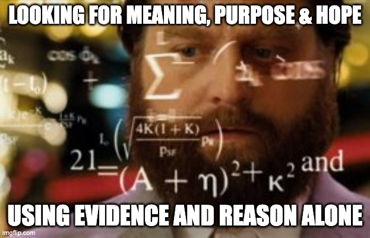

---
layout:
  title:
    visible: true
  description:
    visible: false
  tableOfContents:
    visible: true
  outline:
    visible: true
  pagination:
    visible: true
---

# 3. Bottomline: If Not Evidence and Reason, Then What?

<figure><figcaption>
If not evidence and reason, then what?
</figcaption></figure>

***

_“You never change things by fighting the existing reality. To change something, build a new model that makes the existing model obsolete.”_&#x20;

**― Buckminster Fuller, American architect and systems theorist**

_"Anything that gives us new knowledge gives us an opportunity to be more rational."_

**― Herbert A. Simon, American political scientist**

***

## Is it Really Possible to Find Meaning, Purpose and Hope in Life using Evidence and Reason Alone? 

We are lucky to be living in an era when we know so much about our world, discovered through a process that relied upon evidence and reason alone.

In fact, this may possibly be the first time in our history that we can even talk about creating a coherent and comprehensive framework for navigating life's big questions of meaning, purpose and hope, based purely on a foundation of science and engineering, or more broadly, evidence and reason.&#x20;

We are now at a point where those of us who have adopted evidence and reason as their primary guides in life, and have suffered from a loss of meaning as a result, can begin to recover it. And, with that, their sense of wellbeing, belonging, and happiness.

Before this, we didn't even have the required background knowledge for doing this, and as a result, had no choice but to take leaps of faith or just trust our intuitions and opinions.

It goes without saying that a framework based on a foundation of evidence and reason can be far more trustworthy than one based on faith or dogma. Moreover, just like any body of scientific knowledge, such a framework can be openly challenged and even improved by anyone who comes up with something that can be proven to be better.

Also, having the universal common language of science and math at its core ensures that the framework can be widely shared and studied by people with vastly different backgrounds. It can even serve as a unifying force for all people around the world, no matter their religious, philosophical or ideological leanings.

Beyond that, such a framework can provide new and deep insights into reality that, for many, can even bring a sense of sense of awe and gratitude for being a part of something so awesome. Such feelings are normally associated with faith-based lines of thinking, but it is possible to recover them even on this path.

Over the next few chapters, I intend to describe such a framework that can accomplish all of the above and then some.

But before we go there, let us go over some disclaimers and potential sources of confusion.

(Note: You will see me using the words “evidence and reason”, “rationality”, “science and engineering”, or just “facts and logic” somewhat interchangeably in this book. I am aware of the philosophical nuances that make them slightly different from each other, and we will talk about that when needed.)

## First, Some Disclaimers 

I want to emphasize that I am not against any religion or philosophy. This book is not trying to stir up a controversy on that topic like so many other books that talk about science or rationality.

I am basically just a curious person with a STEM background. I have simply followed my curiosity honestly and diligently and, to my own pleasant surprise, discovered some very interesting results and ideas in the existing scientific literature that provide all the basis needed for answering the deeper questions of life. I have had to add just a few extensions of my own and connect everything together into a coherent whole to form a complete framework.

Moreover, as I already mentioned in the chapter on Motivation, going through this exercise has been personally useful to me. It helped has brought a certain level of serenity and clarity to my life. I have also been able to recover my sense of awe and gratitude about life that we usually associate with faith.

And most importantly, I have a strong basis for saying all of this. I don't just know the "whats", but also the "whys", to the best extent possible.

As I went about researching the material for this book, and the vague outlines of a framework started crystalizing in my mind, many seemingly disconnected concepts that were all tangled up in my head got straightened out and a new sense of understanding emerged out of the clutter.

Many of the details got even clearer as I started writing things down, structuring them in a way that made sense to me, adding diagrams to explain them visually and so on.

They say that you only understand something well when you try to explain it to others. I have found this to be absolutely true. I have learned so much more about this topic, and even about myself, while writing this book.

Also note that, just like any other ideas in science, none of the ideas presented here should be taken as final or unquestionable. They are all evolving even as I write, just like all of science is.

This is another reason for thinking of the ideas in this book as a collection of scientific facts and results, not as a philosophy or doctrine. Everything in it can be challenged, tested, proven wrong, improved or replaced. If you disagree with anything, feel free to make your case. If your idea is better, it will replace the current idea and strengthen the overall collection of ideas presented here as a result.

But I can also imagine some of you rolling your eyes.

There is a persistent dogma, even among scientists and engineers themselves, that things like meaning, purpose and hope are outside their scope.

As a result, embarking on building such an endeavor might come across as either incredibly naive or unbelievably arrogant.

Not without good reasons either. Recent history is full of “tech-bros” getting carried away with too much hubris and arrogance, getting into areas they had no depth or breadth in. So it would be perfectly reasonable to ask: Am I acting like one of them?

I am painfully aware of such objections. I accept the fact that this project is rather audacious and your skepticism may be justified. I am a skeptic too, just like most scientists and engineers are, so I can totally empathize with such suspicions.

So let me try to address some of these suspicions and objections in advance.

## The Audacity of Finding Hope (and Meaning and Purpose) Using Evidence and Reason Alone 

No kidding! Certainly this endeavor is rather audacious, if I may say so myself. So allow me to offer the following arguments in my defense:

### A) We Already Use Science and Engineering to Answer Life’s Other Important Questions 

In the old days, it was customary for people to go to religious leaders when they were facing important life decisions such as what career path to choose or whom to marry or how to get rid of some ailment they may have been suffering from, and so on.

This was fine when we didn’t have any better ways of answering those questions. But over time, we have discovered far more reliable methods, based on science and engineering.

Here is a list of such questions and the modern methods we routinely use to answer them:

#### 1) What occupation should I choose?

Modern methods: Creating a personal occupational and psychological profile, matching it to career profiles, looking at employment statistics and jobs databases, browsing career social networks etc.

#### 2) How do I improve my health?

Modern methods: Medicine, diet plans, exercise regimes, therapy etc.

#### 3) How do I find my life partner?

Modern methods: Psychological profiling, meetup or dating services, social media, relationship advice etc.

#### 4) Where should I live?

Modern methods: Maps, demographic data, employment and living cost data, weather, and other statistics etc.

#### 5) How can I become wealthier?

Modern methods: Financial planning, investing, budgeting, insurance, accounting, entrepreneurship etc.

As you can see, all of these modern methods are primarily based on using evidence and reason.

Wouldn’t the next logical step be to use the same methodology to answer life’s deepest questions also? In fact, don’t some of the questions from the list above partly rest on answering the deeper questions?

What’s the hold up then, besides some dogma that somehow, these deeper questions are beyond the reach of reason?

Even if you could make only partial progress using this approach, wouldn’t that be preferable to relying on something for which there seems to be no basis at all?

Which brings us to my next defense.

### B) This is the Need of the Hour 

The "meaning void" and "meaning crisis" that I mentioned in the last chapter are real.

Studies after studies have shown an alarming increase in depression and anxiety, polarization and intolerance, nihilism and conspiracy theories that have their roots in people not being able to find authentic and deep sources of meaning in their lives.

In addition, as a result of the amazing strides we have made recently in science and technology, our ways of life and ways of thinking have been seriously upended. In many cases, the frames of reference, realities of life  and ways of thinking that were in vogue when various world religions or philosophies were developed aren't even available anymore. We have changed practically every other aspect of our lives: the way we make a living, educate ourselves, connect with each other, feed ourselves, entertain ourselves, and so on.&#x20;

This makes it urgent that we review the ideas of meaning and purpose that have been around for centuries and have formed the basis for a lot of our culture and institutions.

Moreover, some of the new technologies like AI, robotics and genetic engineering are raising entirely new questions about what it means to be human or what life itself means. It won’t be too long before we are forced to make serious decisions about how to deal with them.

We badly need a rigorous framework that is based on our updated body of knowledge and is able to address these challenges effectively.

The cost of not doing so can be high, which brings me to the next point.

### C) Meaning Traps 

We supposedly live in the “Postmodern Era”, which arose as a reaction to the excesses of the “Modern Era” that preceded it.&#x20;

The Modern era was based on grand, centralized, all encompassing theories and ideologies, many of which were based on science and rationality, but taken a bit too far. Unfortunately, during the Modern era, the pendulum swung too far, and as a result, it was only natural for it to reverse course and swing too far in the opposite direction.

This is what gave rise to the Postmodern era, which rejected everything that the Modern era stood for. Grand, centralized narratives of Modernism went out the door and Postmodernism set us free to find our own way.

A common refrain of our times is, you don’t need someone to tell you how to find meaning in your life, you can make it up yourself. Anything you feel is meaningful, by definition, is. Period.

This is a classic case of throwing the baby out with the bathwater.

Unfortunately, this has led to many people falling for all kinds of superficial or even dangerous ideas. The usual culprits here are fads, totally made-up or shallow causes, conspiracy theories, opportunistic “influencers” touting various flaky schemes, and so on.

People who have been set adrift as a result of the Postmodern ideology can easily fall into such Meaning Traps. Some of these traps even provide some sense of meaning, purpose and community, but people eventually get disappointed or at least confused. Worse, they get stuck in such traps, sometimes ending up just digging themselves deeper into the traps.

For many people, this means accepting defeat and returning back to religious or philosophical ideas that they had left behind, while simply setting their doubts aside.

What I am trying to do is to offer a way to move forward instead of going back. A framework for meaning that is based on the deep, wide and proven body of knowledge known as science and engineering can help such people free themselves from such traps while avoiding the shortcomings of other approaches.

This brings us to probably the most important question of all.

### D) If Not Evidence and Reason, Then What? 

If some real phenomena can not be explained by evidence and reason, or rationality, then what would you suggest we use?

If you believe that some phenomena is forever beyond the reach of reason, but you still believe it to be real, then, knowingly or unknowingly, you are admitting that you believe in some magical or supernatural power.

This is because there is no other way. We have only two choices for creating explanations or solutions: evidence and reason, or faith.

Yes, it is true that some phenomena are too complex or too nebulous or even completely unknown or unexplainable at present, and some of them may even be unknowable. But just because we feel that there are some limitations to the rational approach does not mean we can suddenly take leaps of faith! How does that rabbit get out of the hat?

The rational approach not only allows us to discover and accept its limitations, it also allows us to keep learning more and keep updating our answers accordingly. This sort of evolution is built into this approach.

Faith based approaches typically don't allow for any of that.

Isn’t it a lot better to base our thinking on whatever is known today than making up some baseless stories that just sound too good to us? Isn’t it better to see what we can do with what we are sure of, and keep improving it as we learn more, than simply dreaming something up and insisting that it is the truth?

Moreover, what if there is a way to reach our goal of finding meaning, purpose and hope in our lives while still remaining within the bounds of reason? Then we have no reason to take leaps of faith, right?

So we will that here and see where it takes us.

Ok, if even that argument didn't convince you, maybe I can try some other arguments that are commonly used when undertaking other audacious projects.

### E) Think of This as Another “Moonshot” Project 

We live in a world where “moonshot” projects are highly celebrated.

Some people want to go to Mars, some want to build superhuman intelligence, some want to build technology that will allow us to live forever, some want to build fusion power plants and so on.

If they can dream about that and get everyone excited and participate, why not something a lot more immediately useful, feasible and, dare I say, noble or even divine, like finding a more reliable and defensible source of meaning, purpose and hope in our lives?

It is almost a no-brainer in comparison to the degree of difficulty, risk and expense of those other moonshot projects. It is not even close.

I can promise you, there is no chance this endeavor will lead to any massive explosions or extinctions or zombie plagues! At worst, you will just learn something new and deep about reality while keeping your life and limb intact.

Ok, after having addressed the optimists among us, let me say a few words to the traditionalists among us.

### F) Well Established Precedent 

This point is mentioned briefly in the Preface, but it deserves being repeated here.

Centuries ago, people believed that epidemics or natural disasters were God’s punishment for something that people had done wrong.

Then, over time, we discovered that these were natural phenomena with scientifically provable causes. Then, over time, we even figured out what really causes them, how to deal with them when they occurred, make some predictions about them, and sometimes even prevent them from occurring in the first place.

It was our reliance on the process of science and engineering that allowed us to come this far.

This same process has been repeated in so many other arenas of life. In each case, people used to believe that certain phenomena were mysterious, governed by some supernatural force. But over time, piece by piece, we were able to come up with rigorous explanations for them, and then improve our lives using the newly acquired knowledge.

Today, no one objects to the scientific explanations of those phenomena. And I believe we can make the same thing happen here.

Finally, allow me to make a democratic argument.

### G) Another Voice in the Conversation 

As the title of the book suggests, this is an account of one man’s search for meaning. I am not at all claiming that what I am proposing here will necessarily work for everyone.

Different people will approach the issue from different angles. I’d much prefer a situation where mine becomes one of many such perspectives.&#x20;

I hope that the perspective I am proposing will appeal to at least some people, particularly those with a STEM background who are unafraid to trust their nerdiness.

In fact, if it can help them, then I am really obliged to do so. If it doesn’t, they can ignore it and no harm done.

Moreover, I do have some evidence that this way of thinking works in at least once instance - because it is working for me.

I am not saying that my life has been completely transformed due to the ideas in this book - changing lives takes a long time, particularly if you aren’t facing any immediate crisis. But I have definitely noticed a change in me towards feeling more peaceful, more confident and more aware. I am also seeing new nuances and more insights in simple and familiar things I encounter every day.

Most importantly, I now have a framework and toolset for analyzing events and decisions in my life from a new, firm and rigorous basis.

All of this gives me confidence that my voice is worth adding to the conversation.

Anyway, those are all the arguments I have come up with so far. As I discover more, I will add to the list.

I hope that the arguments satisfy most critics, so without further ado, let us dive in.

## Time to Pull Up Our Sleeves 

This reminds me of the motto of Blue Origin, Amazon founder Jeff Bezos’ space company. I think it is quite pertinent here.

> _“Gradatim Ferociter!” (Step by step, ferociously!)_
>
> **― Motto of Jeff Bezos' space company Blue Origin**

So let us put on a moonshot engineer’s hat and take a step by step, but ferocious look at meaning, purpose and hope.

Needless to say that this triumvirate of words get thrown around a lot, but if we are going to analyze them rigorously, we need to establish what we are talking about from the very basics.

Words do not exist by themselves, they need a foundation and context, particularly when they are such important words and you are talking about looking at them from a new perspective.

Moreover, since these words ultimately deal with reality, and we want to do everything from First Principles, we need to start there. We will start with what we know about our ultimate reality, at least the parts that are relevant to our purposes and look at every layer above that until we get to our goal.

In the end, we want to end up with a rigorous framework that is built from scratch using the methods of science and engineering. It should be a well-founded, well-reasoned and coherent way of finding meaning, purpose and hope in our lives.

To start with, let us give the framework a name and then quickly go over its parts.&#x20;

I am calling this framework the “Meaning-Seeking Entities” (MSE) Framework. We will soon get to see why it is named this way.

## The “Meaning-Seeking Entities” (MSE) Framework 

Right off the bat, let us observe that “Meaning-Seeking Entities” sounds like a scientific or engineering term. This is very much intentional.

The term generalizes the idea of complex and conscious living organisms such as ourselves that have an innate desire to seek meaning in their lives.&#x20;

Generalizing the term allows us to potentially cover other meaning-seeking entities such as societies of living organisms that act like conscious organisms of their own, or even artificial or alien lifeforms that may exhibit similar attributes.

Thus, this is a framework that defines, from the ground up, layer by layer, what Meaning is, what Meaning-Seeking Entities are, how they come about and how they can find what they seek.

Each of the concepts below maps directly to a layer in the framework and there is a chapter dedicated to each of them.

### **A) Methodology:** 

The most fundamental aspect of defining a framework from First Principles is establishing what constitutes genuine knowledge according to the framework and what methodology is used to acquire it. Another word for this is Epistemology.

This is also where we will address the most important objection to what we are undertaking: limits to rationality and how we plan to deal with them. Our solution to this problem is to define a modified version of rationality, which I have termed Mindful Bounded Rationality. We will go over what it means and why it makes sense.

### **B) Ultimate Reality:** 

The next step is defining our model of ultimate reality, which is basically all that exists.

Needless to say that the knowledge of ultimate reality itself must be acquired using the methodology mentioned above.

Of course, we won't go into all aspects of ultimate reality - that will take volumes. We will look at only the parts that we need for our framework.

### **C) Physical Reality:** 

We take it for granted that we live in a physical reality, but we also need to acknowledge that it may not be the ultimate reality. We do not really know how physical reality emerges from ultimate reality, but its existence is evident to us because we can perceive it using our senses.

Moreover, we have known for a long time that at least some aspects of physical reality appear to exhibit discernible patterns i.e. we can discover features and laws that seem to govern their structure and function. Physics is essentially a collection of such patterns.

But we also know that some things in physical reality are too nebulous to be captured as patterns, and somethings are still to be discovered.

Here again, we will go over the parts of physical reality that matter for our framework.

### **D) Life:** 

Normally, one would include Chemistry and Biology as the two layers immediately above Physics, but we don’t need to make that distinction for this framework. For our purposes, clubbing them together into one layer called “Life” is sufficient.

Also, we will often use the term “Living Entities” rather than just “Life” because we want the term to represent all phenomena that display the characteristics of living organisms, starting from single cells to individual organisms (including AI or aliens) to organized groups or societies of such organisms, to even abstract concepts that may exhibit the same characteristics.

Also, normally we would consider Intelligence to be a layer above this, but again, for the purposes of this framework, we will include it along with Life. As you will see in the chapter on Life, it makes a lot of sense to treat intelligence as an inherent property of living entities.

### **E) Consciousness:** 

Consciousness means different things to different people.&#x20;

For the purposes of this framework, when we say “consciousness”, what we mean is “phenomenal experience” or “subjective experience” or "what it is like to be you".

Consciousness is one of the deepest enigmas of existence. We do not understand it very well, yet somehow it feels self-evident to us.

Typically, scientists and philosophers get stuck at this problem or even just ignore it altogether.&#x20;

But in typical engineering fashion, we will not let its enigmatic nature hinder us, as long as we can still achieve our ultimate goal. We will try to understand what we can, use what we can, and see if we can continue to make progress.

As an aside, this is a critical difference between the engineering approach and the scientific or philosophical approach to problems, and why I feel so much more confident in using this approach where the scientific or philosophical approaches have problems.

### F) Meaning: 

The topic of “meaning” has been so muddied that we need to start by defining what the word even means. We need to figure out how to define it scientifically, what its essential attributes are and then figure out how all of this fits in the framework.

We will start by crisply defining what we mean by “Meaning-Seeking Entities”. This will be followed by how the MSE Framework can help us find meaning in our lives.

After we have done all this hard work, tackling purpose and hope become rather easy.

### **G) Purpose:** 

Here again we start by defining the term “greater purpose”. And then we will figure out how to define it using the framework.

### H) Hope: 

It goes without saying that any framework that purports to explain life, the universe, and everything should be expected to provide a strong foundation for hope, otherwise it will lose its appeal to most people.

And, luckily for us, hope simply falls out of the MSE Framework. Moreover, it can be shown to be well founded, not merely wishful thinking, as it is in pretty much any other framework.

That will complete the discussion of all the layers in the MSE Framework. Lastly, it will be time to wrap it all up.

### **I) Executive Summary:**&#x20;

Everyone is busy, and reading long books is not always possible.&#x20;

In this chapter, I will provide a quick summary of the framework and, in true executive fashion, some calls to action that contains some ideas about how to turn the recommendations from the book into actions.

### J) Q\&A:

Finally, it will be time to do some "rude" Q\&A. Given that this is a rather difficult subject, and I have taken a slightly unconventional approach, I can absolutely imagine that people have many tough questions. Bring them on!

## The Meaning-Seeking Entities (MSE) Framework - Chapters and Agenda

Here is the list of the main concepts we will talk about (with a chapter dedicated to each concept) and the questions we will address in each. This should give you some hints about how the framework will be constructed.

**Methodology:**

* What types and sources of knowledge are we allowed to use to build the MSE Framework?
* What principles and methodology do we use to build the MSE Framework?
* What do we do when we don’t know something?
* What are the limits to rationality and how does the framework deal with them?
* What is Mindful Bounded Rationality?

**Ultimate Reality:**

* What is the true nature of reality? What exists?
* What is the MSE Framework model of ultimate reality?
* What aspects of ultimate reality do we need to worry about for our framework?

**Physical Reality:**

* How well do we understand physical reality?
* What features and laws of physical reality are pertinent to defining meaning, purpose and hope?
* What are patterns and nebulosity?
* What is entropy and why does it matter to us?
* What is coherence and why does it matter to us?
* What is complexity and why does it matter to us? What is its relationship to entropy?

**Life:**

* What are the essential characteristics of life as far as the framework is concerned?
* How does life emerge from physical reality and what purpose might it serve?
* What is the Physics Theory of Life?
* What are the Free Energy Principle and Active Inference?
* How does intelligence emerge in living organisms and what purpose does it serve?

**Consciousness:**

* How do we define consciousness in the MSE Framework? What are its features and behaviors?
* What is its relationship to ultimate reality and physical reality?
* What does consciousness have to do with meaning, purpose and hope?

**Meaning:**

* What does “meaning” even mean? Is there a way to define it scientifically?
* What are the “6CED” Tendencies of the universe?
* What are Meaning-Seeking Entities?
* How do we define “meaning” using the MSE Framework?

**Purpose:**

* What do we mean by “purpose”?
* Where might purpose come from?
* How do we define “purpose” in the MSE Framework?

**Hope:**

* What do we mean by “hope”?
* How does the MSE Framework help us find hope that isn’t just wishful thinking?

**Executive Summary:**

* What is the executive summary of the MSE Framework?
* What are some ideas for converting ideas from the book into actions?

**Rude Q\&A:**

* What are the most frequently asked questions about what has been presented in the book?
* What are some of the potential objections to the framework and how can we address them?

Ok, with that high level introduction, we can finally start to dive into each of the layers mentioned above, starting with our Methodology.

