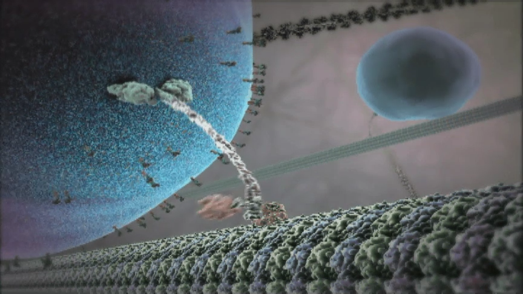

---
layout:
  title:
    visible: true
  description:
    visible: false
  tableOfContents:
    visible: true
  outline:
    visible: true
  pagination:
    visible: true
---

# 7. Life: Entropy and the Pursuit of Complexity

<figure><figcaption>
“Inner Life of the Cell” - Animation developed by Harvard University showing a motor protein carrying a vesicle inside a living cell.
</figcaption></figure>

***

_“The total disorder in the universe, as measured by the quantity that physicists call entropy, increases steadily over time. Also, the total order in the universe, as measured by the complexity and permanence of organized structures, also increases steadily over time.”_

**— Freeman Dyson, Physicist and Mathematician, in "From Eros to Gaia"**

_“An agent does not 'have' a model of its world - it 'is' a model. In other words, the form, structure, and states of our embodied brains do not 'contain' a model of the sensorium - they 'are' that model.”_&#x20;

**― Karl J. Friston, British neuroscientist, in "Behavioral and Brain Sciences" (Journal)**

***

## The Mystery of Life 

Human beings have been on a quest to explain the mysteries of life for a long time.

We have been haunted by questions like: What is life? How is it different from inanimate matter? How did it emerge from inanimate matter? How does it work? And, of course, what is its meaning and purpose?

And for a long time, all we could do was talk about it in religious or philosophical or poetic terms. Even today, most people prefer to talk about life in those terms rather than taking a scientific approach. (Except when they are sick or something.)

We acquired our longing for magic, as we saw earlier, while playing incredibly fun games like peek-a-boo as children. But when we figured out what was really going on, we couldn't experience that magical feeling anymore. So now we are afraid of going too deep into other things we find magical, like life, the universe and everything.

But luckily, not everyone feels the same way.

We have had a constant stream of scientists going after the aforementioned questions of life much more methodically and rigorously, via the sciences of biology, chemistry, and even physics.

And, we have made some amazing progress there.

Robert Hooke’s discovery of the living cell, Charles Darwin’s theory of Evolution, and Francis Crick and James Watson’s discovery of the DNA arguably mark the three of the most important milestones in this quest.

These milestones and many other discoveries have helped us understand the physical organization of life, how and why it has been changing over time, and the underlying code of life that controls a lot of it.

And learning about it has been extremely enlightening, not just because we are literally made of this stuff, but also because we are still governed by the same fundamental principles and processes that gave birth to us, even though we may not always realize it.

We will look at a few of these principles and processes in this chapter, along with how they help us build the MSE Framework.

Note that since we are looking at life through the lens of science and engineering, we will use the more general term “Living Entities” to refer to it. This not only avoids the potential baggage that comes with the heavily loaded word "life", but also generalizes it to other potential forms of life besides biological life, such as organized groups of living organisms or alien lifeforms or even artificial or virtual lifeforms.

## Coherence, Entropy and Complexity, Again 

Let us start with where we left off in the last chapter, discussing the concepts of coherence, entropy and complexity.

As we saw there, the overall entropy of the universe has been increasing in accordance with the Second Law of Thermodynamics. As a result, most things have a natural tendency towards falling apart.

But not always.

We can see ubiquitous and ever-present evidence of the opposite tendency also.

We have already seen two universal tendencies that work in the opposite direction: Coherence and Complexity.

These processes that bring things together continue until eventually we see complex molecules emerge from simpler ones, living cells emerge from complex chemical soups, complex organisms emerge from simpler ones, and self-organized complex societies of organisms emerge from individuals, and an entire biosphere emerges from everything on the planet.

While we understand a lot about all of these processes, we still don’t have a full account of the first step: How life got started at all. We have some pretty solid hypotheses, but still no definitive account.

Luckily, we don’t need to know that in order to define the MSE Framework, because we follow Mindful Bounded Rationality as our methodology. We only care about what is happening with the processes of life right here, right now, to the best extent possible today, while keeping our eye open for future developments.

We have discovered some processes associated with the phenomena of life that are continuously occurring in the present and everywhere, and have formulated some very good theories about how or why that may be occurring.

One of them is American physicist Jeremy England’s theory of Dissipation-Driven Adaptation, which could be described as a “Physics Theory of Life”. Let us take a quick look at it.

## A Physics Theory of Life 

Let us continue with the “ink drop in water” thought experiment that we went over in the last chapter.

So once again, imagine that you place a drop of ink into a glass of water. As we already know, you would expect to see it slowly disperse until the ink reaches an equilibrium with the water, and the entropy of the overall system would be higher than before.

But now, imagine that this blob of ink didn’t dissipate into the water. Instead, it expanded a little, then contracted back, and kept doing that, continuing its “blob-ness” for a while.

You would immediately feel that there is something very unusual going on. It would almost look like the ink blob was “alive” in some sense.

This intuition is perfectly reasonable because that is exactly how Living Entities behave — they may expand and contract or move or change over time, but they don’t completely dissipate into their environment. They maintain their “blob-ness”, at least while they're still alive.

Every living cell can be said to be like a blob of some extremely complex chemicals that resists dissipation as dictated by entropy. Another way of saying that is that it keeps itself far from reaching a state of equilibrium with its environment.

The way a living cell does this is by absorbing low entropy energy from some energy source in its environment and using that energy to keep itself in a low entropy state. In the process, it radiates high entropy energy into their environment, in the form of heat. The technical term for this is "dissipation".

Jeremy England's theory of Dissipation-Driven Adaptation generalizes this idea to any complex "chemical soup". It states that in a complex environment with an energy source, complex entities inevitably and automatically emerge to help dissipate that energy more efficiently than it would otherwise be.

Not only that, but if the energy source or the environment fluctuates from time to time, these self-organized complex entities will try to adapt to those fluctuations in order to continue to dissipate the energy efficiently.

In other words, they will resist reaching an equilibrium with their environment, or alternatively, maintain their far-from-equilibrium state, as long as the source of energy and the complex chemical soup continue to exist.

Such self-organized complex entities are known as Complex Adaptive Systems and the process is called Dissipation-Driven Adaptation.

Note that such conditions existed on early earth for extremely long periods of time. There were various bodies of water with complex molecules in them, constantly interacting with each other. There were also energy sources, such as the sun or the hydrothermal vents at the bottom of the ocean. So, these conditions were perfect for the emergence of such self-organizing Complex Adaptive Systems. It is possible that life emerged as a result of some such mechanism.

That is why this insight is being called a Physics theory of Life. It potentially explains the emergence of life-like processes directly based on physics.

Jeremy England's insight itself is based on two well-established theories in thermodynamics known as the Fluctuation-Dissipation theories of Christopher Jarzynski and Gavin Crooks. in other words, this theory has a strong foundation of well-accepted theories in physics.

By the way, note that we are not claiming that this is how life actually got started on earth. We do not know that for sure yet. We also haven't managed to create new life using this theory.

But we don’t need that for our framework.

As I have stated earlier, in the MSE Framework, what we care about is not what happened in the distant past, nor what happens in the distant future. What we do care about is that we can demonstrate the process of Dissipation-Driven Adaptation occurring anytime.

In other words, irrespective of whether this process actually led to life, the process itself is real.

As a result, we can say that the universe appears to have a natural tendency to spontaneously create higher and higher levels of self-organized complexity, as long as we have a complex set of simpler entities interacting with each other, such as those found on planets like the earth, and an energy source, such as stars like our sun or other geothermal sources.

Needless to say, this is another and even stronger evidence for the natural tendency of the universe towards Complexity that we identified in the last chapter.

But wait, there’s more!

Karl Friston, a British neuroscientist has an even more interesting theory of life, based on statistical physics.

## Friston’s Genius Formulation of the Phenomena of Life 

As mentioned above, Karl Friston is a neuroscientist. So, his original goal was to come up with a fundamental mathematical model of how brains work.

Using various techniques in statistical physics and machine learning, he produced a mathematical model that captures the essence of how a brains function. This model has been incredibly successful at explaining many aspects of brain function. He calls it the Free Energy Principle.&#x20;

But he didn’t stop there.

He discovered that this principle could easily be applied to explain the behavior of all Living Entities in general, starting from a single cell to a large living organism or organized groups of such organisms.

We will not go into the math here, because it will take an entire book of its own to explain. But we will try to understand the intuition behind the principle, as applied to Living Entities.

Let us start by taking a look at the following diagram which shows a simplified version of the principle.&#x20;

It shows a Living Entity (big box on the right) interacting with its environment (the picture of earth on the left).

<figure><figcaption></figcaption></figure>

Let us start by observing that every Living Entity we come across in the world is enclosed inside a semi-permeable boundary or “skin” of some sort.

Mathematicians have a name for this boundary— it is known as a Markov Blanket. And, just like the name suggests, it separates and protects the contents of the Living Entity from its environment.

For example, the cell wall of any single living cell is such a Markov Blanket. The skin that surrounds our whole body is also such a blanket. If one thinks of a country as a Living Entity, then its border can also be thought of as such a blanket.

It is easy to see that the Markov Blanket plays a crucial role in preventing the contents inside from being dissipated into its surroundings. But it goes well beyond simply protecting the contents inside. It also has the capability of allowing chemical compounds and electrical signals in, which can be called perception. And it can also act on its environment, again in the form of chemicals or electrical signals or even physical movement.

Let us go over various parts of the diagram above to understand what is going on in a little more detail.  We will need to do that in order to understand the essence of the most critical aspects of life.

Each of the sections below correspond to one of the terms in the diagram above.

## Internal States 

The first thing to realize is that, any living entity can only survive in a limited range of states. These are the states that are conducive to its continued existence. If the system goes outside this range, it is in danger.

For example, your body has certain states, consisting of its temperature, blood pressure, blood sugar level, and so on. Your body constantly tries to keep the values of these states within a certain range, failing which, you do not function properly. Too high or too low a value of your body temperature or blood pressure or sugar level, and you start having problems.

These states are called “Internal States”, i.e. states internal to the Living Entity, to distinguish them from the states of the environment, which are external to the Living Entity.

Basically, what we are saying is that, in order for a Living Entity to sustain itself, it needs to maintain its Internal States within a limited range of values that are conducive to its survival.

## Hidden States 

Analogously, the environment also has a large number of states.

For a simple system like an amoeba swimming in water, the environmental states may be characterized by simple parameters like water temperature, pressure, salinity, acidity, distance from a predator and so on.

And since these states are external to the Living Entity and thus unknown to it, we call them “Hidden States”.

## Perception and Action 

Now, the environment keeps changing constantly, which is to say that the Hidden States keep changing constantly.

For example, in the case of the amoeba, the water temperature, salinity, distance from predators etc. keep changing.

Any such change to a Hidden States could impact the Living Entity. There is always the danger that some of these changes will force the Living Entity to go outside the safe range of its own Internal States, potentially causing it to not function properly or even die.

It goes without saying that, in order to sustain itself, the Living Entity needs to be able to:

1. Perceive the changes to the environmental or Hidden States, (for example, the water temperature on its right is becoming too cold)
2. Analyze them to figure out how to respond (for example, determine that it needs to move where it is warmer and realize that means moving to the left, where it is warmer), and then
3. Take appropriate actions (for example, actually move to the left).

As hinted at earlier, the Markov Blankets of Living Entities are capable of performing functions 1) and 3) above. These are depicted in the diagram above with the labels Perception and Action, respectively.

The second part, analyzing the input and deciding how to respond, is accomplished by the Living Entity creating and maintaining an internal “Model” of the environment, as we will see below.

This Model is built by the Living Entity, based on its learnings from its previous experiences of interacting with the environment: What changes occurred in the environment, what actions it took, and what happened as a result.

If the results were good, the relationship between those environmental changes and the decisions the Model came up with would be reinforced. If not, they get weakened. Over time, the model gets better and better at making the right decisions.

(Of course, most Living Entities have ancestors, and a lot of this learning gets passed down from generation to generation via genes. But we don’t need to get into that detail yet. We will get to it eventually. For now, let us just say that it learns this by itself.)

Here is an example to illustrate this further.

Let us say you are looking at your social media feed and you come across something outrageous or triggering. Your eyes perceive it and notify your nervous system.

Luckily for you, you have experienced this before. Your internal model has learned, from your past actions, that clicking on that item will simply lead to your feed getting inundated with more and more outrageous and triggering items. You will just get more and more triggered and outraged. Not only will you waste your time, but you will ruin your whole day.

So you stop yourself from clicking on that item. Instead, your internal model tells you to switch to the far more rewarding activity of reading books about engineers finding meaning in their lives.

\[ Good for you! You have proved that you are an excellent Living Entity with a great future! ]

## Generative Model and Active Inference 

As we have mentioned above, when a change in an environmental Hidden State is perceived by a Living Entity, it relies upon an Internal Model to decide how to respond to it.

But it can do even better.

The Internal Model isn’t just reactive, it can also be proactive. So it doesn't just respond to changes in the environment, it can even get ahead of them by imagining things that could happen and be ready for them.

Think about what the Internal Model needs to do to accomplish this.

The Model needs to be able to make reasonable predictions about what the environment might do next, and prepare a set of responses to deal with them.

But, in order to figure out what responses might be appropriate, it has to be able to actually experience those conditions in the environment and respond to them to see what happens. This means it has to actively seek such conditions out.

In order to accomplish this, the Living Entity needs to do two things:

1. Its Internal Model needs to be “generative”, i.e., capable of generating possible futures about what the environment might do next. These are known as “counterfactuals”. And
2. It has to take actions to seek these counterfactual conditions out in the environment.

This process is called Active Inference. Active because it is not just passively inferring the Hidden States of the environment, but actively imagining what they could be and then actively seeking evidence for their existence.

## Surprise!

Note that the ultimate goal of this exercise of Active Inference is to avoid surprises!

The recent Covid-19 pandemic provides an excellent case study for this.

The global health system can be thought of as a Living Entity with a generative model for world health, with the WHO and affiliated organizations being its home.

Such a model can be expected to be able to predict, based on its past experiences, as well as its generative ability, that pandemics of various types may occur at any time. And it needs to be ready for them with appropriate actions such as early warning entities, isolation protocols, vaccine research, educational campaigns and policy prescriptions.

A lot of this planning and strategizing involves imagining scenarios that could unfold (including ones that may have never occurred in the past) and preparing for them.

Of course, the scenarios they generate cannot be completely random. They need to be within the realm of possibilities given their knowledge of how the world works.

Typically, organizations such as the WHO would come up with realistic scenarios, conduct simulations, mock exercises, strategic and tactical planning exercises and so on to actively infer what types of responses would work in those situations.

The ultimate aim of this exercise is to ensure that if another pandemic were to break out in reality, even if it is of a different character, it will not be a surprise to the global health system, and it will be able to respond immediately and effectively.

## Minimizing Surprise 

As mentioned earlier, the Free Energy Principle involves a lot of complicated math. The end result of that math is a formula that calculates the amount of surprise that a Living Entity might experience when its environment changes in some way. The formula further states that this surprise needs to be minimized in order for the Living Entity to continue to exist.

It should be intuitive that minimizing unpleasant surprises should result in the Living Entity being able to respond to the change in the environment effectively, keeping itself intact.

In mathematical terms, minimizing surprise is also called “minimizing the free energy” (hence the name, Free Energy Principle).

(Note that the “free energy” mentioned here is not related to the concept of energy from physics. This is a separate concept from statistics.)

Another mathematical term for the same process is “maximizing Bayesian Model Evidence”. Essentially the intuition here is that the Living Entity wants to collect evidence that its Internal Model is robust against changes to the environment. Once again, it goes without saying that the better the evidence for the model, the better chance the Living Entity has of continuing to exist.

The main takeaway here is that when you update your internal model to minimize surprise, or improve its “Model Evidence”, you are basically becoming better at predicting what the environment might do next and respond effectively to it.

## Hate Surprises? Good for You!

Here is another interesting example to illustrate the idea better.

It is a common practice to surprise people on their birthdays. And very often, the person having the birthday ends up suspecting that something is up and isn't really surprised.&#x20;

How does that happen?

All of us have models of our family members’ or friends’ behaviors inside our minds, based on their past behavior. We can also imagine the ways they might behave if they were trying to hide something from you. So, when they start acting in a weird manner, we notice that it is similar to how we had imagined they would behave if they were hiding something from us.

Based on all of that, we make a prediction that there may be some kind of a surprise coming our way, though we may not know all the details.

Then, we may start asking probing questions and see how they respond to them. Or look for evidence around the house of unusual activity.

This gives us more clues and reduces our uncertainty further.

All of this is another way of saying that we instinctively use our Perception, Internal Generative Model and Actions to perform Active Inference and minimize our surprise!

(So, people who say “I hate surprises” were right after all! Avoiding surprises is exactly what every Living Entity is inherently wired for! If you are one of those people who hate surprises, feel free to feel totally vindicated!)

Ok, that pretty much sums up the essence of the Free Energy Principle without going any deeper into the math.

## Continuity of Existence or Identity

The main takeaway from all the discussion above is that Living Entities are constantly trying to minimize surprise with the intention of continuing to survive in spite of their environment changing all the time.

And all of this happens all on its own. Every Living Entity, starting from a single cell to complex living organisms to organized groups of organisms are doing this automatically all the time.

So it looks like we have discovered another natural tendency that the universe seems to have: the tendency to create entities that inherently try to Continue to exist.

### <mark style="color:orange;">**Universal Tendency #3: Continuity (of Existence or Identity)**</mark>

<mark style="color:orange;">**The universe appears to have a natural tendency to create complex entities and processes that try to continue to exist or maintain their identity over time.**</mark>

Having looked at the two main ideas connecting life and physics that have been developed fairly recently, let us now turn our attention to another important aspect of life, namely intelligence.

## Intelligence 

It is interesting to note that Friston wasn't looking for a principle that governs living entities. He was looking for the way a brain functions. In other words, he ended up discovering a fundamental principle of life while looking for a fundamental principle of intelligence.

This was probably not an accident.

It is common to think of the phenomena of life as separate from that of intelligence. Many people think that primitive life like bacteria and algae etc. are unintelligent and one has to get to larger, more complex creatures before we can call them intelligent.

But, as we just saw, every living cell necessarily has to have some amount of intelligence just to be able to maintain itself in a dynamic environment that might surprise it.

It has to have the ability to perceive its environment, create and maintain a generative model of the environment based on past experiences, generate counterfactuals, look for evidence for them, use the model to make decisions, and then act on those decisions. All of these activities look very much like intelligence.

For example, the Merriam-Webster dictionary defines it as “the ability to learn or understand or to deal with new or trying situations.” Google defines it as “the ability to acquire and apply knowledge and skills.”

Even the simplest bacteria can be said to have such capabilities, albeit at a very basic level appropriate for their limited range of activities.

In fact, when you look at all the things that happen inside a living cell, one could argue that the most intelligent entity in the universe, per unit of volume, is a living cell! The human brain may be far more intelligent overall, but it pales in comparison to the complexity and capability that a living cell packs in such a small volume.

All you have to do is to watch some of the living cell simulations (or even videos of actual living cells under a microscope) to see the incredibly complex and varied activities occurring inside living cells. These include various molecules being ferried around in very purposeful and intelligent ways, complex structures being built or dismantled, cell walls allowing or rejecting various chemicals from entering the cell and so on. Watching a movie of a cell dividing into two, including how the DNA gets duplicated is simply awe inspiring. White blood cells hunting down an intruder is nothing short of a nail-biting drama.

All of this occurs at the cellular level like clockwork, in an environment full of chaos. Way more chaos than most of us experience in our daily lives!

It is simply amazing to realize that all of that is going on inside every cell in your body, right here, right now!

(As an aside, anyone who thinks that science kills magic, or awe or even gratitude from our lives, should really watch such videos and then close their eyes and imagine all those things occurring inside their own body billions of times. They will instantly recover all of what they may have felt they had lost and more.)

I see no reason to think of all of these activities occurring inside living cells as unintelligent.

Of course, this isn’t abstract or theoretical or artistic or other forms of intelligence that we typically associate with human brains. A living cell isn’t going to beat you in IQ or chess or music composition. But it can absolutely beat you in terms of the amount of complexity and variety it handles in such a small volume.

Now, you might think that I am about to add another item to our growing list of universal tendencies. But I decided against doing that here, because, as I already stated, life and intelligence seem to be very closely tied to each other, and we have already accounted for life in the tendency of Continuing to exist.

But no worries, this universe we have ended up with is so awesome, we still have a few more tendencies to discover and appreciate.

## Evolution 

As quickly mentioned earlier, not every behavior learned by the Internal Model of a Living Entity is learned within its own lifetime. A lot of it gets passed down from generation to generation.

But even that process is more intelligent than simply copying what a parent has learned to a child.

That intelligence takes the form of small variations in information passed down, which are called mutations.

One can think of a mutation as another way for the Internal Generative Model of a Living Entity to come up with counterfactual scenarios. It then actually brings such an offspring into existence which then proceeds to seek evidence for the mutation. If such evidence is found, then the mutation is good. If not, then it is bad, and the corresponding mutation dies out.

This, as everyone knows, is known as Evolution by Natural Selection.

But, based on the analogy above, one can think of even evolution by natural selection as another instance of Active Inference. The generative model in this case is the DNA along with the process of replication and mutation at the time of cell division.

But wait, there is even more.

## Organized Groups and the Biosphere 

This process of complex adaptation through Active Inference doesn’t stop at the individual level. It continues to expand wherever possible by making individual Living Entities self-organize into groups and interconnected webs of such groups forming ecosystems and eventually the entire biosphere.

In the case of human beings, they may take the form of families, communities, commercial or social organizations, and countries.

And in all of those instances, the Free Energy Principle and Active Inference continue to apply.

All of these organized groups usually have explicit or implicit boundaries, try to perceive changes in their environment as clearly as they can, create as accurate models of their environment as they can, and perform actions as effectively as they can.

For example, companies have HR departments that bring needed people in from outside (hiring) or send unneeded people outside (firing). They also have other departments that monitor and model their customers, suppliers, investors, competitors, and so on. They also create projections of future behaviors of those constituencies, and take into account how their environment might change and how they would need to plan and respond.

Through these actions, all of them try to keep themselves far away from being seriously surprised and getting destroyed i.e. reaching equilibrium with their environment.

And the process of evolution is seen even in these instances, in social systems or culture or economics and so on, which are continuously evolving. In other words, evolution appears to be another ubiquitous and ever-present Universal Tendency.

With that, as you might have guessed, we can add another item to our list of Universal Tendencies.

### <mark style="color:orange;">**Universal Tendency #4: Evolution**</mark>

<mark style="color:orange;">**The universe appears to have a natural tendency to create complex entities and processes that evolve towards more complex and sustainable forms through a process of natural selection.**</mark>

### &#x20;

## The Need for a New Law of Nature 

Needless to say, many scientists have noted the prevalence of these Universal Tendencies we have been collecting: Coherence, Complexity, Continuity of identity or Existence and Evolution.

While we do have the law of evolution in biology, what we really need is a deeper and broader law of nature that encompasses all of these processes in all of these contexts, starting from quantum fog to galaxies.

Luckily for us, some scientists have started putting forth proposals in this direction. I am hopeful that these efforts will gain traction and become as well-known as the law of entropy.

Following is an excerpt from one such paper that hints at all the Universal Tendencies we have covered so far:

> _“Physical laws—such as the laws of motion, gravity, electromagnetism, and thermodynamics—codify the general behavior of varied macroscopic natural systems across space and time. We propose that an additional, hitherto-unarticulated law is required to characterize familiar macroscopic phenomena of our complex, evolving universe. An important feature of the classical laws of physics is the conceptual equivalence of specific characteristics shared by an extensive, seemingly diverse body of natural phenomena. Identifying potential equivalencies among disparate phenomena—for example, falling apples and orbiting moons or hot objects and compressed springs—has been instrumental in advancing the scientific understanding of our world through the articulation of laws of nature. A pervasive wonder of the natural world is the evolution of varied systems, including stars, minerals, atmospheres, and life. These evolving systems appear to be conceptually equivalent in that they display three notable attributes: 1) They form from numerous components that have the potential to adopt combinatorially vast numbers of different configurations; 2) processes exist that generate numerous different configurations; and 3) configurations are preferentially selected based on function. We identify universal concepts of selection—static persistence, dynamic persistence, and novelty generation—that underpin function and drive systems to evolve through the exchange of information between the environment and the system. Accordingly, we propose a “law of increasing functional information”: The functional information of a system will increase (i.e., the system will evolve) if many different configurations of the system undergo selection for one or more functions.”_
>
> **― “On the roles of function and selection in evolving systems” | Michael L. Wong et al | PNAS Vol. 120 | No. 43 October 24, 2023**

## Curiosity and Creativity 

Throughout this entire discussion of the Free Energy Principle and Active Inference, as well as Intelligence and Evolution, you may have noticed that all Living Entities inherently demonstrate two behaviors that we typically associate with human intelligence, though at levels appropriate to their context.&#x20;

Those behaviors are curiosity and creativity.

Curiosity, because the process of Active Inference involves a Living Entity going out and seeking evidence of the counterfactual scenarios its internal generative model has thought up. This can be interpreted as the Living Entity being curious about its environment. For a very good reason, that it doesn’t want to be surprised.

In case of complex entities, the curiosity can also go inwards, where the entity is so complex that it needs to model its own behavior to avoid being surprised by itself.

And Creativity, because the internal generative model imagines these counterfactual scenarios. Sometimes, those scenarios involve not just being curious and seeking evidence, but creating something new entirely.

For example, birds build nests, bees build hives and beavers build dams. All of these can be seen as innately creative behavior by those creatures, that they have learned through evolution.

And we don’t even need to say anything about the immense amount of creativity unleashed by the process of evolution. Everything you see in the biosphere, from simple bacteria and algae to complex creatures such as ourselves, as well as complex self-organized packs and societies of various social organisms were all created by the process of evolution. It is by far the best and most abundant example of creativity we can see!

In fact, another word for the biosphere, or even the entire universe, is Creation.

With that we can now add these two to our list of universal tendencies.

### <mark style="color:orange;">**Universal Tendency #5: Curiosity**</mark>

<mark style="color:orange;">**The universe appears to have a natural tendency for creating entities and processes that exhibit curiosity.**</mark>

### <mark style="color:orange;">**Universal Tendency #6: Creativity**</mark>

<mark style="color:orange;">**The universe appears to have a natural tendency for creating entities and processes that exhibit creativity.**</mark>

## &#x20;

## Diversity 

As of now, the Standard Model of Physics recognizes seventeen distinct elementary particles—twelve fermions and five bosons. And that doesn’t even account for the flavor and color combinations and their antimatter counterparts. If we do that, we end up with a total of 61 particles.

As per the latest version of the Periodic Table, we have discovered (or synthesized) 118 elements, each with unique properties.

We have identified seven main types of stars, grouped by their temperature, color, and luminosity: O, B, A, F, G, K, and M.

We have classified planets into 6 different types by mass, 15 types by orbital characteristics and 17 types by composition.&#x20;

And all of that doesn’t even account for other types of celestial bodies, like comets, asteroids, supernovae, gas clouds, galaxies of various types and interplanetary objects.

Back on earth, there is a tremendous variety in the types of living cells that exist and the various organelles they contain. And the total number of plant and animal species we have ended up with is in the millions.

I could go on for a long time listing the variety of geological features, weather phenomena, water features, ecological niches and so on that exist right here on earth, not to mention on the uncountable number of planets all over the universe.

All of these varieties of everything have unique characteristics, and they combine and interact with each other in a large variety of ways to give rise to a combinatorial explosion of diversity in the universe.

The point I am trying to make here is that the universe contains a mind-boggling amount of diversity, which formed all by itself.&#x20;

While there is clearly a lot of overlap between this and the various other universal tendencies we have identified, including Complexity, Evolution, Curiosity and Creativity.&#x20;

Still, I think it helps to identify it as another universal tendency because, as we like to say in the field of AI, "quantity has its own quality". When you have a huge amount of something, it has its own emergent behaviors that did not exist in the constituents.

As a result, we can add one more item to our list: Diversity.

### <mark style="color:orange;">**Universal Tendency #7: Diversity**</mark>

<mark style="color:orange;">**The universe appears to have a natural tendency for creating a large amount of diversity of various types.**</mark>

### &#x20;

## Mindfulness 

This brings us back to one of the most central concepts in this book.

The behavior displayed by all Living Entities, as described in this chapter, which, as we saw, can be derived directly from physics, could actually be described as “mindfulness”.

Allow me to explain why. Time to expand our minds.

Not just our minds, but even the definition of what we mean by a mind.

We will say that the concept of "mind" includes intelligent, agentic, curious and creative behavior displayed by all living organisms, appropriate for their level. This way, it applies to all Living Entities that we have described: living cells, organisms, organized communities of organisms, ecosystems and so on.

Mindfulness, at the human level, is a practice that helps us clear our minds of thoughts that distract us from paying our full attention to what is going on around and inside ourselves.

Through various techniques, the practice teaches us how to calm our minds, clear it of all the stuff that occupies it most of the time, and focus our attention on the present moment and situation.

This allows our perception to become sharper and more wide ranging, which helps our internal models to become better at modeling our true reality, and, as a result, makes our actions more effective.

Well, as we have already seen, that’s nothing but Active Inference! That's exactly what every living organism is inherently doing all the time!

Every living cell keeps itself whole and functioning in the highly dynamic physical world by sensing its environment as accurately as it can, updating its internal model appropriately, and acting on the environment in accordance as effectively as it can.

And, over time, either via the process of its own learning or genetics or evolution, this inherent functioning of the entire phenomena of life gets better and better.

This is exactly what the practice of Mindfulness tries to teach - improving our perception of what is happening around as well as inside us, processing it without getting biased or distracted, thus improving its accuracy, and responding to it as effectively as we can.

Since the simpler organisms don’t have complex minds such as ourselves, they don’t really need to learn any practices like Mindfulness to quiet their minds. Their "minds", such as they are, are already pretty quiet. They mostly just performing Active Inference without any distraction generated by their minds, and as a result, one can say that they are inherently practicing mindfulness all the time.&#x20;

This can also be characterized as tacit or embodied mindfulness. So while we have to learn this practice, they are just born with it.

It is interesting that we had to wait for human thought to evolve for millennia before we rediscovered something that was inherent to all living organisms!

And now that we have, it is only reasonable that we embrace it like we would a long-lost friend.

I hope this also clarifies why, in the chapter on Methodology, we decided to name our methodology as Mindful Bounded Rationality. Qualifying rationality in this manner not only makes sense based on the reasoning provided in that chapter, but it can even be derived from First Principles.

One can even argue that Mindful Bounded Rationality is the inherent methodology of all Living Entities.

Mindfulness forms a central idea in this book and keeps popping up in multiple places, not because it is popular these days, but because it can be scientifically proven to be a critical aspect inherent to all Living Entities.

Of course, invoking mindfulness before we have really delved into the mind may appear a little premature. So let us do that in the next chapter: Consciousness. It is the next logical layer in our framework.

