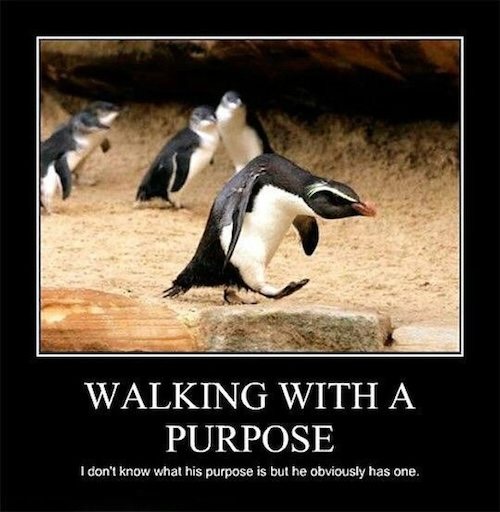

---
layout:
  title:
    visible: true
  description:
    visible: false
  tableOfContents:
    visible: true
  outline:
    visible: true
  pagination:
    visible: true
---

# 10. Purpose: The Universe “Wants” You to “6CED”!

<figure><figcaption>
Ultimately, penguins and us share the same purpose
</figcaption></figure>

***

_“Life is never made unbearable by circumstances, but only by lack of meaning and purpose.”_&#x20;

**― Viktor E. Frankl, Austrian psychiatrist, in “Man's Search for Meaning”**

_"For the mystery of human existence lies not in just staying alive, but in finding something to live for."_&#x20;

**― Fyodor Dostoyevski, Russian novelist, in "The Brothers Karamazov".**

***

Having done the hard work of defining Meaning-Seeking Entities and Meaning itself in the last chapter, defining Purpose becomes rather easy, as we will see in this chapter.

But first, as usual, we need to talk about what we even mean by purpose.

## What is “Purpose”? 

The second Matrix movie (“The Matrix Reloaded”) contains a perfect speech on purpose, delivered by none other than Agent Smith:

> _“There's no escaping reason, no denying purpose, for as we both know, without purpose we would not exist. It is purpose that created us, purpose that connects us, purpose that pulls us, that guides us, that drives us; it is purpose that defines, purpose that binds us.”_
>
> **― Agent Smith, in "The Matrix Reloaded".**

I know I have taken this quote out of context, but it is actually very meaningful when taken out of context. (I guess I must have learned this trick from social media - taking things out of context because they serve your purpose!)

Still, this quote serves my purpose here so well, I hope you will remember it and mull over it as we go through this chapter.

Now, sure, you might say that Agent Smith, a computer program, and an evil one at that, wouldn’t be your first choice to go for advice on purpose. While that may be a little "substrate-ist" (a belief in the supremacy of intelligence born out of a biological substrate), I am going to indulge you this time.

So, let us look at a well-regarded quote by one of the most respectable (and highly quotable) philosophers:

> _“He who has a ‘why’ to live for can bear almost any ‘how’!”_
>
> **― Friedrich Nietzsche, German philosopher, in "Thus Spoke Zarathustra".**

The “why” that Nietzsche refers to is, of course, purpose.

Here is a dictionary definition of purpose:

> _"Purpose: Why you do something or why something exists."_
>
> **― Cambridge English dictionary**

In the context of this book, when we say “purpose”, we are basically replacing the two “somethings” in the above definition with our actions and ourselves, respectively.

So, we are talking about why we do the things we do and why we exist in the first place.

And again, the “we” here could be a single individual or a group of people or even all of life.

This is also typically referred to as “greater purpose”, to distinguish it from everyday purpose like "why did the chicken cross the road?"

Finally, here is an excerpt from a recent scientific literature survey on the science of meaning:

> "Purpose is a central, self-organizing life aim that organizes and stimulates goals, manages behaviors, and provides a sense of meaning.”
>
> **― Laura A. King and Joshua A. Hicks, in "The Science of Meaning in Life", Annual Review of Psychology 2021**

People have been wondering about their life’s greater purpose for a very long time, usually spurred on by some particularly traumatic event in their life or a major life decision that forced them to take a step back and examine their life honestly and carefully. They were confused about what to do next and had to go back to basics, i.e., first principles, to figure out what they really wanted out of life, what they felt was their greater purpose.

Moreover, as we saw in the last chapter, having a sense of purpose leads to people feeling that their lives are meaningful resulting in higher levels of happiness, and even health and wellbeing.

Needless to say, purpose is a critical concept for human beings, or Meaning-Seeking Entities in general.

## Where Does Purpose Come From? 

For a long time, most of humanity has believed that purpose is a mysterious concept with a supernatural origin.

This line of thought originates in the belief that there is a supernatural power that knows everything, including why it has created this universe, where it wants it to go and what it has in mind for each of us. Our life’s purpose is whatever this supernatural entity wants us to do.

Unfortunately, this means that we are left to guess what the supernatural power has in mind for us or simply take the word of some authority for it or accept whatever our community or zeitgeist tells us what it is.

Luckily, as followers of the Mindful Bounded Rationality methodology, we have a much better option: We can look at the abundance of evidence that can be seen here and now and everywhere, process it rigorously and see if it can lead us to some valuable conclusions.

And the good news is that there are many clues to be found in the evidence we have already managed to collect about reality, and those clues can absolutely reveal our greater purpose.

## Deriving “Greater Purpose” from First Principles 

As we saw in the previous chapter, the universe exhibits certain natural tendencies, that we have termed the “6CED” Tendencies. These are: Coherence, Complexity, Continuity (of existence or identity), Curiosity, Creativity, Consciousness, Evolution and Diversity.

These tendencies give rise to coherence and complexity in the universe, some of which self-organizes itself into self-sustaining and (sometimes) conscious, creative and curious organisms that evolve and diversify.

As we have said many times, but it may still be worth repeating, these phenomena can be observed right here, right now.

How do we interpret this fact?

Let us look at an example. Say that you are a parent and you notice that your kid just loves to take anything that looks like a stick and beats it rhythmically against every surface they can find. It could be a spoon or a toothbrush or a chopstick or whatever they get their hands on that day. And no matter how much you try to distract them with other activities or toys, they always revert to this activity.

Moreover, this has been going on for a long time! It doesn’t look like just a phase, but very likely an inherent tendency and passion. Clearly the kid wants to become a drummer or a percussionist of some sort.

As a parent, you might even wonder if becoming a drummer is his life's purpose. The evidence is clearly pointing in that direction.

Similarly, could we interpret the ubiquitous and omnipresent exhibition of the “6CED” Tendencies by the universe as the universe “wanting” something? Could we say that the universe has been and is being “purposeful” in its behavior?

Again, let us be clear that we are not talking about any sort of mysterious purpose given to its creation by a supernatural power here. We are only trying to make sense of clearly observed tendencies of the universe, using words in our language that sometimes take on certain theological connotations.

One could ask: How else would we interpret these tendencies that the universe displays? If there is another word for it, say “X”, how does “X” differ from “purpose”?

I don’t really see a way to differentiate between the two. If we dissociate the concept of purpose from its theological connotations, we are still left with a very meaningful word.

I am aware that this issue has been discussed at length in philosophy under the heading of "the Is- Ought Problem". But I think that way of thinking has a major problem, and I have included a [Deep Dive at the end of this chapter](10-purpose.md#deep-dive-the-is-ought-problem) to go over it.

In short, we can absolutely conclude that the universe exhibits strong evidence of having a purpose, without invoking any sort of theological connotations.

Moreover, we can also say that we, as Meaning-Seeking Entities, share the same purpose because we ourselves emerged as a result of those same 6CED Tendencies, and continue to exhibit them.

The 6CED Tendencies are continuously guiding us as well as the entire universe, towards our "greater purpose".

We have no need to associate some imaginary features or behaviors to some mysterious supernatural power or wait for some imaginary (and unpredictable) moment of judgment in the far future when the supernatural power reveals our true purpose to us. We have all the clues we need right here, right now.

As we saw in the quick introduction to the book, if a bee’s purpose can be determined by simply observing its structure, characteristics and behavior, we can do the same for the universe as well as ourselves. Indeed, doing so is exactly what our Mindful Bounded Rationality methodology would guide us towards.

There is just one more thing we need to add. Just like we did while deriving our definition of “meaning in life” in the previous chapter, we need to account for the existence of nebulosity and unknowns in the universe. And the solution is the same: adding mindfulness, moderation and willingness to learn to our definition.

Once we do that, we have a rigorous and complete definition of purpose, derived from first principles.

We can state it formally as follows:

### <mark style="color:orange;">**Definition of Our “Greater Purpose” Based on the MSE Framework:**</mark>

<mark style="color:orange;">Given that the "6CED" Tendencies of the universe continuously give rise to coherence and complexity in the universe, some of which self-organizes itself into self-sustaining and (sometimes) conscious, creative and curious organisms that evolve and diversify, we can conclude that that is at least one of the purposes of the universe.</mark>&#x20;

<mark style="color:orange;">And since we are Meaning-Seeking Entities ourselves that are a result of the same tendencies and continue to exhibit them ourselves, our greater purpose is the same.</mark>&#x20;

<mark style="color:orange;">Thus, our greater purpose is to continue our own existence, while facilitating the creation and maintenance of other self-organizing and self-sustaining complex entities, creating more coherence and richer complexity and diversity around us, contributing to the universal process of evolution, being curious and creative, and continuing to enrich our consciousness. Note that the complex entities mentioned here refer to not just living organisms, but also other entities that exhibit similar tendencies, such as organized groups or institutions of living organisms, bodies of thought, and even artificial organisms.</mark>

<mark style="color:orange;">In addition, given the existence of nebulosity and unknowns in the universe, we need to avoid being dogmatic and always be humble and willing to learn and improve our definition of greater purpose accordingly.</mark>

## Turning the Definition of Purpose into Action

Ultimately, one needs to be able to convert their purpose into action. So, how do we do that for the purpose as defined above?

Let us look at each of the 6CED Tendencies and come up with some initial ideas for turning them into actions. This may look a little like a typical self-help TODO list, but it is only meant as an example to spark thinking along these lines. The list is by no means definitive or complete. It will evolve over time as we learn more about what works and what doesn't.

* **Coherence:** Our struggle to make sense of our lives, of our environment, of the economy, our relationships and so on are all a part of this. Of course, in order to align ourselves with our purpose, we need to actually take this seriously rather than simply doing whatever some social influencer or your friend circle or some book (including this one) tells us to do. First try to make sense of whatever you are being told, and if it does, only then turn it into practice.&#x20;
* **Complexity:** What this typically translates into is "being constructive" rather than destructive. For the physical world, it could mean building complex things. For the inner world, it could mean complexifying our minds by seeking out complexity and trying to understanding it better and communicating it to others.
* **Continuity of existence or identity:** This could mean something as simple as taking care of your health and wellbeing, along with that of your family and friends, your community, all the way up to ensuring the sustainability of the entire biosphere. All of these are Meaning-Seeking Systems, and they all depend upon each other to achieve their aims of continuation of existence.
* **Curiosity:** This one is easy: Always try to be curious and open minded, willing to experience new phenomena and learning from them. This is the natural behavior of our Bayesian brains, and it is only when we get stuck in routines or become dogmatic about some belief that we deviate from that.
* **Creativity:** This one is also easy: Always try to be creative. And, in particular, creating things that embody at least some of the other 6CED Tendencies. One of the best ways to do that is to create or facilitate the creation of Living Entities of all types.
* **Consciousness:** Simply being mindful is one of the best ways to enrich your conscious experience, and over time, enrich your consciousness itself. One can also add other rich experiences to their repertoire, like listening to music or appreciating good art or reading good books.&#x20;
* **Evolution:** Needless to say, our biological desire to participate in evolution is a part of this. But also participating in iterative improvement of everything we do or every organized group we belong to could also be seen as a part of this.
* **Diversity:** This involves recognizing the value of and facilitating the enrichment of diversity in all aspects of the world. It also means detecting when diversity is being destroyed or monoculture is replacing it and slowing or preventing that from happening.

And of course, in order to be respectful of nebulosity and unknowns in reality, we need to exercise mindful moderation and willingness to learn and improve the above list of actions accordingly.

Not only that, but even a cursory look at the list will reveal that, at times, some of these tendencies or actions might be in conflict with each other. This is where mindfulness comes in again, in deciding how to prioritize and schedule actions accordingly.&#x20;

Moreover, this time, because you know the reasoning behind how these tendencies and actions were arrived at, you can make far more informed decisions about the prioritization and scheduling as compared to pretty much any other method of meaning making or realization.

As I mentioned earlier, this list is only a set of sample suggestions, just to clarify the definition of purpose. Feel free to build your own as it applies to your own life, experiment with it and see what works.

Finally, to recap everything we have said in this chapter, let us look at a diagram that summarizes how we have arrived at a rigorous definition of Purpose using the MSE Framework.

## Derivation of Greater Purpose using the MSE Framework 

<figure><figcaption></figcaption></figure>

### &#x20;

## Description of the Diagram 

As shown in the diagram, Meaning-Seeking Entities are conscious living systems such as ourselves, that seek meaning in their lives. They came about due to the 6CED Tendencies of the universe, and they continue to exhibit those tendencies themselves.

These tendencies are: Coherence, Complexity, Continuity of existence or identity, Curiosity, Creativity, Consciousness, Evolution and Diversity.

As we already saw in the chapter on Consciousness, our desire for a sense of purpose in our lives arises in our consciousness. This is possibly because consciousness itself is a virtual life form that we give birth to, and it needs to perform Active Inference in order to continue to exist. This process makes it come up with counterfactuals, one of which may be a desire to imagine a purpose behind all the activities it is performing.

At the same time, the ubiquity and omnipresence of the 6CED Tendencies strongly indicate that the universe as well as all Meaning-Seeking Entities inherently seems to have a direction or “purpose”. The direction is towards the continuation and further enrichment of the 6CED Tendencies.

So it makes sense to simply define our Greater Purpose as mindfully realizing and strengthening our alignment with the 6CED Tendencies.

In addition, given the existence of nebulosity and unknowns in the universe, we need to avoid being dogmatic and always be humble and willing to learn and improve our definition of purpose accordingly.

## What Happens if Someone Doesn’t Agree with this Definition of Purpose? 

Note that there is no supernatural power or authority that is forcing us to accept this definition of our purpose, or threatening to punish us if we don’t.

We have something far more interesting here. Since we are Meaning-Seeking Entities that were born out of the 6CED Tendencies and continue to exhibit them ourselves, we are inherently bound by this purpose, whether we realize or accept it or not.

We can say that enforcement is built into the laws of the universe themselves. There is no need for any additional policing.

For example, it's just like gravity. You can stop believing in it, but it still applies to everything you do.

As the Matrix quote we saw earlier says, “there is no escaping reason, no denying purpose”. The quote is literally, scientifically, factually, true!

On the other hand, if one realizes this and aligns themselves with this purpose, they will automatically have the forces of nature in their favor, and they will be a part of the great journey that the universe is on. If the universe is going places, all one has to do is to hitch their ride to it and they will go places along with it.

One would rather have the forces of nature working for them than against them, right?

Maybe this is exactly what Yoda meant in the following dialog:

> _“For my ally is the Force, and a powerful ally it is. Life creates it, makes it grow. Its energy surrounds us and binds us. Luminous beings are we, not this crude matter. You must feel the Force around you; here, between you, me, the tree, the rock, everywhere, yes.”_
>
> **― Yoda, in “The Empire Strikes Back”**

Maybe the “Force” that Yoda and all the Jedi talk about is the collection of the “6CED” Tendencies that the universe has! We just have to recognize how they are working and align ourselves to them.

But wait, there is more! Having the above realization and acting accordingly has one additional benefit: Hope simply falls out of it.&#x20;

We'll talk about that in the next chapter.

***

## **Deep Dive: The Is-Ought Problem**

When western philosophers started looking at Purpose, they quickly realized a major problem: Talking about purpose determined by a supernatural power involves statements containing the words “ought / ought-not”.

For example, “you ought to be a good person (even when you don’t want to)” or “you ought not steal (even if you really want something that you can’t afford)”.

On the other hand, science is based on evidence and reason, and as a result all its statements are of the form “is / is-not”. All science can tell you is how something is or is not. It can’t tell you what it ought to be.

In fact, there is no logical way to derive “ought / ought-not” statements from “is / is-not” statements.

This is known as the Is-Ought Problem in philosophy, and it has been used to prove that science can never say anything about things like purpose.

But, in my humble opinion, there is a subtle problem with this way of thinking. Let us take a slightly deeper look at it.

If you remove the supernatural power from the equation, then the word "ought" really means "if one were to move forward in time and look back, what would have been the best choice".

But here again, the ability to move forward in time is fiction. We have no way of doing that.

Given this fact, what are we left with?

The best way can say is, if we are following the methodology of Mindful Bounded Rationality, then the best we can do would be to replace "ought" with “given everything we know at present, what _is_ our most optimal choice".

Isn’t this what we end up doing in real life? In fact, in common usage, “ought” is pretty much used interchangeably with “is most optimal”.

For example, you might say, “I ought to take the train instead of the plane because both my current location and where I want to go are within walking distance of the respective train stations, whereas the airports are way out of town”. In other words, taking the train is your most optimal choice.

I know, “is most optimal” isn’t exactly the same as “ought”, but it is a good enough "satisficing" approximation and, realistically, it may be the best we can do.

Now, it is true that even figuring out "the most optimal" would involve knowing our current situation exactly, knowing how the situation is going to evolve exactly, so then we can compute the best option. But, as we have seen, trying to do this computation quickly becomes intractable. Moreover, the presence of nebulosity and unknowns makes the assumption of exactness above dubious at best.

This is why we have evolved techniques like heuristics and evidence-based practices that have been proven to work in the past and have a decent probability of working in the future. In reality, those are our best tools for making choices.

True, that ideally, we would have liked to know exactly what the supernatural power had in mind for us. But given that we don't, and we don't just want to take a leap of faith or take someone else's word for it, we have no other choice.

That is why we have chosen to replace the unknowable and intractable “ought / ought-not” with the tractable “is it or is it not most optimal”.

