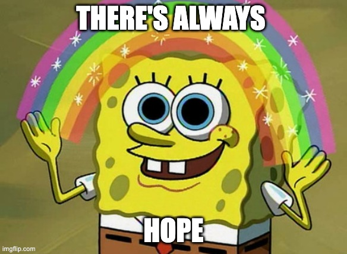

---
layout:
  title:
    visible: true
  description:
    visible: false
  tableOfContents:
    visible: true
  outline:
    visible: true
  pagination:
    visible: true
---

# 11. Hope: Past Performance is a Great Indicator of Future Results

<figure><figcaption>
This statement can be scientifically proven to be true.
</figcaption></figure>

***

_“The very least you can do in your life is figure out what you hope for. And the most you can do is live inside that hope. Not admire it from a distance but live right in it, under its roof.”_

**— Barbara Kingsolver, American novelist, in "Animal Dreams"**

_"the greatest white pill of all is that local minima are rare in high dimensional spaces"_

**— Roon, AI researcher, in a Tweet**

***

## &#x20;

## What is “Hope”? 

Once again, let us start with a crisp definition of what we are talking about, so we can analyze it scientifically.

The Merriam-Webster dictionary defines hope as “desire accompanied by expectation of or belief in fulfillment”.

The critical word here is “expectation” because it implies trying to make a prediction about the future.

Unfortunately, reality is incredibly complex and our ability to predict the future, even with the knowledge of all the laws of nature that we have discovered, drops off rapidly as we move forward in time.&#x20;

This is partly because of the aforementioned nebulosity and unknowns in reality, but also because the computational complexity of calculating all the actions and their reactions simply becomes overwhelming.

In reality, the most optimal approach is to make some educated guesses based on known information, but remain open to adjusting them as we move forward.

In the past, when our knowledge of the laws of the universe was very limited, all we could do was to assume that there was a benevolent supernatural power looking after the universe, and it had a complete plan for what it wanted the universe to do. Then, as long as we kept our faith in that power, the beneficence of the supernatural power would result in positive outcomes for us.

This was perfectly reasonable given our level of knowledge of reality at that time. But today we know a lot more about how the universe works, and how it has been progressing from the time it began, and we can actually start to make some fairly reasonable educated guesses based on that knowledge, instead of taking leaps of faith.

## Past Performance and Future Results

Take the example of the stock market.

Now, it might sound a little flippant of me to equate the future of one’s life or of humanity, or indeed even the universe, with the stock market, but when you take a closer look, it turns out to be a pretty useful and meaningful comparison, as we shall soon see.

Of course, the first thing that gets thrown at you whenever anyone talks about the markets is the following standard disclaimer: “Past performance is no guarantee of future results!”

And that’s certainly true. Given how complex the market is and the number of factors that can affect it, we can never give a guarantee.

At the same time, past performance is actually a pretty good indicator of future results! In fact, it may even be the best indicator of all.

Pretty much all our planning and predictions, not just financial, but also things like career choice or life partner choice or lifestyle choice etc. are heavily based on taking a good look at the past performance of those choices, maybe customizing it to our specific situation, and making a judgment about whether that performance is likely to continue in the future.

With that in mind, let us look at the past performance of life, the universe and everything.

## The Best Track Record Ever! 

Imagine you are an investor deciding whether to invest in this company called The Universe Corp.

You, being a disciplined investor who believes in fundamentals, don’t go and buy whatever is cool and trending. You go straight for the balance sheet, looking at the performance history of the company going back all the way to its founding.

As far as we know today, The Universe Corp. began operations nearly 14 billion years ago. What has it been doing all this time? What are its major accomplishments?

We have gone over this story before, but it is worth repeating quickly.

Right from the beginning, the universe has exhibited some inherent tendencies, and, as time passed more tendencies have emerged. These are, of course, what we have been calling the 6CED Tendencies: Coherence, Complexity, Continuity of existence or identity, Curiosity, Creativity, Consciousness, Evolution and Diversity.

All along and everywhere, the universe has been executing on these tendencies, without taking a single break. While there have been many twists and turns, ups and downs, catastrophes and upheavals, it has nevertheless relentlessly pressed forward. For billions of years!

Stars have formed and exploded, planets have bumped into each other, and even entire galaxies have collided. Planets like earth have faced unbelievable natural calamities, like massive asteroid impacts, super volcanoes, severe climate changes, devastating epidemics and unbelievable amounts of violence.

Throughout all of that, The Universe Corp. has continued to execute on its mission to continue and enrich its 6CED Tendencies.

And this continues to this day. Right here, right now, it is possible to find evidence of the 6CED Tendencies continuing to express themselves.

This shows no signs of slowing down. In fact, it may even be accelerating, diversifying and complexifying even further.

It would be an understatement to say that this is the most amazing track record of all time, anywhere! By far. Any comparison with anything else would be completely laughable.

If you were to discover such a company, would you jump up and down and invest in it? Would you even put your entire nest egg in it? And not only that, but, after having invested thus, would you completely relax, knowing fully well that your future was in great hands? The greatest hands ever, in fact?

It would be a no brainer!

Well, isn’t this exactly what we mean by hope? Reasonable expectation of an excellent future?

Still, let us take a closer look at it to make absolutely sure.

## How “Meaning” Enters the Picture 

When we talk about hope in the context of our lives, we typically associate it not with any expectation, but specifically with a positive expectation. We hope that our lives will be better, at least in some way, in the future.

Which raises the question: How do we define “positive” here? What is a "better" life?

Everything we have looked at so far has been in service of finding meaning in life. So, it would be  reasonable for us to define a positive life as a meaningful life and hope as the expectation of a more meaningful life.

That’s why, in the MSE Framework, we define Hope as “reasonable expectation of a more meaningful life in future”.

And the good news is, if we align ourselves with the 6CED Tendencies of the universe that have the unbelievable track record as described above with a great expectation of continuation, and even improvement, of that performance, hope simply falls out of it as a natural consequence.

In other words, aligning ourselves with the “6CED” Tendencies can give us a “reasonable expectation of a more meaningful future” i.e. hope.

Moreover, unlike all other definitions of hope, this definition isn’t based on just some wishful thinking, or some dream that is not backed by anything substantial.&#x20;

On the contrary, our definition has the best type of thinking and backing that one could ever ask for: first principles thinking and the incredible unbroken track record of the universe, respectively.

This is a far more powerful and reliable definition of hope than any other that one could come up with.

As usual, let us elucidate this with a diagram that explains all of the above thinking in a hopefully more memorable form (at least for visual learners such as myself).

## Derivation of Hope using the MSE Framework 

<figure><figcaption></figcaption></figure>

## Description of the Diagram 

As you can see in the above diagram, the desire for Hope arises in Meaning-Seeking Entities due to them possessing Consciousness. As we have already seen, this could be explained as consciousness itself performing Active Inference in order to continue to exist.

On the other hand, the “6CED” Tendencies of the universe, that gave rise to the Meaning-Seeking Entities in the first place, have an unbelievably strong track record of existing for billions of years all the way until now, and we can absolutely expect them to continue as far as we can predict in the future.

Not only that, but these tendencies can be observed here and now.

As a result, if we recognize and improve our alignment with these tendencies, then we can justifiably have strong expectations of a meaningful future, which is the same thing as having hope for the future.&#x20;

Note that this definition is based on a preponderance of evidence and reason, not wishful thinking.

So let us formalize this with a definition:

***

#### _<mark style="color:green;">Definition of Hope Based on the MSE Framework:</mark>_

_<mark style="color:green;">Mindfully realizing and improving our alignment with the universe's (and ours) 6CED Tendencies ensures that we can have a very reasonable expectation of a meaningful future, which is the same thing as having Hope.</mark>_

_<mark style="color:green;">In addition, since reality consists of nebulosity as well as unknowns, we need to be open to learn more as we move forward and adjust our thinking and actions accordingly.</mark>_

***

## The Human Tendency for Hope 

Before we go on, I would like to tell you a very interesting story about hope.

Human history, and before that, the history of life in general, is full of horrible calamities such as pandemics, famines, wars and so on.&#x20;

Our ancestors, going all the way back to the first living cell, somehow managed to pull through all of them.

In particular, one seriously apocalyptic period in the history of the human species really stands out.

Scientists have discovered evidence showing that, a long time ago, humanity went through a prolonged “population bottleneck”, when the total population of humans on earth dropped to near-extinction levels.

Here is a quote from one related study of this time period:

> _"Results showed that human ancestors went through a severe population bottleneck with about 1280 breeding individuals between around 930,000 and 813,000 years ago. The bottleneck lasted for about 117,000 years and brought human ancestors close to extinction."_
>
> **— Wangjie Hu, Ziquian Hao, et al in “Genomic inference of a severe human bottleneck during the Early to Middle Pleistocene transition”**

Just 1280 breeding individuals! Today we number more than 8 billion. That's one weirdly shaped bottle.

The same study also discovered that this decline appears to have coincided with a period of major climate change. It is very possible that the decline was caused by that climate change.

Now put yourself in the shoes of a human being living through this period.&#x20;

In particular, think about living through the period leading up to this bottleneck, when human population must have kept relentlessly declining for a long period of time, maybe even lasting decades or centuries.

Today, we get scared when market pundits talk about the possibility of a decade of slow growth!

Imagine what those people went through. They very likely experienced some of the worse famines humanity has ever faced. Climate disasters, food and water scarcity, disease and possibly even violent conflicts as a result, lasting a long time. Maybe even generations.

It’s true that people probably didn’t have a sense of the global nature of the catastrophe that befell them at that time. They probably witnessed only its local effects. But even those must have been unbelievably devastating.

Which raises an interesting question.

What kind of individual manages to survive such a gut-wrenchingly hopeless time period, over a time span that possibly lasted their whole lifetime? Surviving in a community or culture that must have been transformed, possibly having lived through calamity after calamity for generations? Watching everything around them falling apart and never get better?

The logical conclusion is that these must have been some unbelievably hardy and resourceful individuals, driven by an insatiable capacity for hope! They must have kept on trudging as everyone around them either fell or gave up hope.

Also, given that this period possibly lasted for many generations, the genetic as well as cultural underpinnings of this level of hopefulness and hardiness must have gotten more and more concentrated among the survivors.

The ultimate survivors that finally emerged from the bottleneck must have been the most resourceful and hopeful human beings ever!

And guess what, all of us are their descendants!&#x20;

It is these survivors that eventually managed to stabilize and then grow their population, eventually resulted in the 8 billion people that exist today.

It should go without saying that we carry a lot of their genetic and cultural legacy in our blood and our culture. It will keep providing hope to us and our future generations for a long long time.

This could be thought of as another case of “past performance is a great indicator of future results”. Any species that managed to survive that bottleneck and thrive can be expected to keep going for a long time to come, no matter what catastrophes befall them.

We can look at this episode in human history as another example of the incredible track record of hope for the 6CED Tendencies of the universe in general as well as specifically of the human race itself.

## Awe and Gratitude 

Having come up with such a strong definition of hope based on evidence and reason alone, I am myself now overwhelmed by hopefulness and so want to go one step further.

I want to conclude this chapter with something even beyond hope, almost venturing into the territory normally reserved exclusively for religion: The feelings of awe and gratitude.

The entire stack of layers that make up the MSE Framework is nothing short of “miraculous”.

We can start right from the bottom.

The fact that anything exists at all is the most unbelievable miracle. There was no need for anything to exist, but it does. It meets the definition of a miracle because it is a positive phenomenon and we have absolutely no explanation for it.

Beyond that, it is also miraculous that reality contains many discernible patterns that follow well defined laws. There was no need for that either. Reality could have been a whole lot of nebulosity and randomness. But it isn't. This is another miracle.

Moreover, we have managed to grow brains that are able to capture these laws as mathematical formulas. Some of these laws of physics and other sciences contain some constants (such as the gravitational constant or the Plank’s constant or the speed of light etc.) that have very specific values. So specific, that if some of their values had been even slightly different, we would not be here.

Why is this the case? We have no idea, hence it is another miracle.

Moreover, these laws have eventually led to the creation of life, life has led to intelligence and the mysterious phenomenon of consciousness. As a result, creatures like ourselves can wonder about all this and try to make some sense of what’s going on.

The phenomenon of life appears to have a built-in goal of continuing to exist and spreading, endowing all living systems with the purpose of continuing and supporting that process to the best of their ability. This fact also provides a tremendous source of hope and meaning to all living systems.

All of the above phenomena can be thought of as legitimate miracles. There was no need for any of them to exist. But they do, and we are the ultimate beneficiaries.

Also, even if the scientific paradigm does not allow us to proclaim that we know any ultimate truths, it still provides us a rigorous way to discover many useful patterns, build useful things using them, and keep making progress.

What’s really really remarkable about this is that we were able to discover and formulate all of these phenomena simply by following evidence and reason. There was no need to invoke any kind of magic or take leaps of faith.

And we still ended up with awe and gratitude.

Do we really need any more miracles than that? Isn’t all of this sufficient to fill our minds with awe about existence and gratitude that we are here to experience it and even understand it to some extent?

As far as I am concerned, I don’t need anything more miraculous or more awesome or more deserving of my gratitude than this!

With that, it is time for us to conclude this discussion and take some questions. We'll do that in the next chapter.

