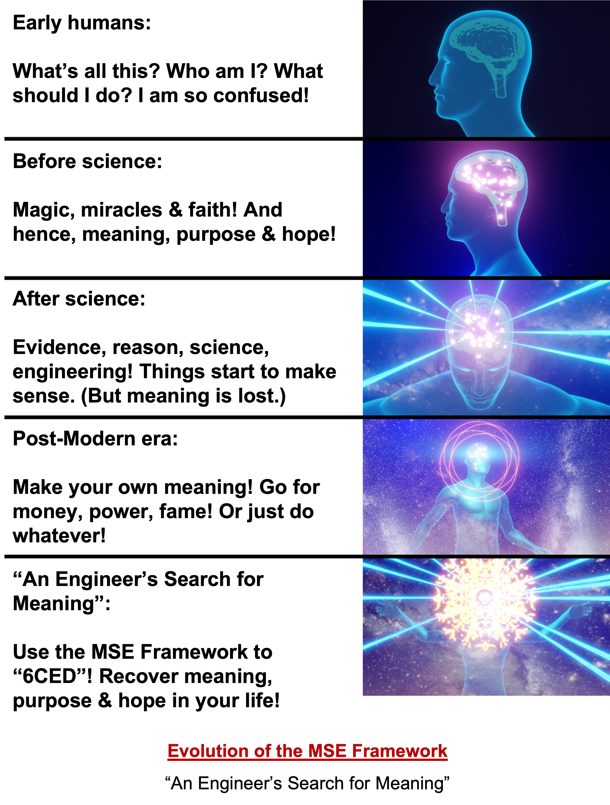

---
layout:
  title:
    visible: true
  description:
    visible: false
  tableOfContents:
    visible: true
  outline:
    visible: true
  pagination:
    visible: true
---

# 12. Executive Summary: Use the MSE Framework to “6CED” in Life (and in Business)!

<figure><figcaption>
"Explain it to me like I am an executive."
</figcaption></figure>

***

_"Yet what is more awesome: to believe that God created everything in six days, or to believe that the biosphere came into being on its own, with no creator, and partially lawlessly? I find the latter proposition so stunning, so worthy of awe and respect, that I am happy to accept this natural creativity in the universe as a reinvention of 'God.'_

**- Stuart Kauffman, in “Reinventing the Sacred”.**

### &#x20;

_“Science is not only compatible with spirituality; it is a profound source of spirituality.”_

**― Carl Sagan**

***

Congratulations on your promotion to the C-suite! It is your magnificence and generosity that makes the world work.

\[ Sorry, I have to poke a little fun at executives if I am going to be taken seriously as an engineer, right? No offense intended of course. ]

Speaking of wanting to be taken seriously then, here is the serious summary of the book.

## Executive Summary of the MSE Framework 

* The **Meaning-Seeking Entities (MSE) Framework** provides a way to find meaning, purpose and hope in life based on known scientific facts and engineering practices alone. No leaps of faith or reliance on someone's opinion are necessary.
* **Meaning-Seeking Entities** are defined as conscious living entities, such as ourselves, that have an innate desire to seek meaning, purpose and hope in their lives. (A more formal definition is included further down.)
* The MSE Framework is a **First-Principles**-based framework built upon the foundation of evidence and reason or rationality alone. It relies on rigorous explanations of reality that were painstakingly obtained using **Bayesian Inference** and the **Scientific Method**.
* Unfortunately, **rationality has limits**, due to the existence of tremendous **complexity, nebulosity and unknowns** in reality, as well as our relatively limited cognitive abilities. This has been used as an excuse to say that concepts like meaning, purpose and hope are beyond the reach of rationality. But just because rationality has limits does not mean that we can suddenly jump to faith or magic or opinions as the basis for our thinking. We can do a lot with rationality, as long as we remain mindful of its limits and adapt to them.
* In order to deal with these limits, the framework uses a modified version of rationality as its methodology, known as **Mindful Bounded Rationality (MBR)**. This methodology is characterized by concepts from Bounded Rationality as well as the practice of Mindfulness, such as **Satisficing, Heuristics, Present-moment focus, Grounding in reality (rather than abstractions) and Non-judgmental observation**, in addition to the Thinking from First Principles, Bayesian Inferencing and Scientific Method mentioned earlier. Doing so ensures that we don't get carried away with zealous pursuit of abstractions and purity, and trying to fit reality to them instead of the other way round.
* To build the framework, we start with the axiom that we live in something like an **Ultimate Reality.** We do not have direct contact with it. We can only experience it through our senses, as **Physical Reality** or via introspection, as **Consciousness or Phenomenal Experience.** Since both of them are fundamental and self-evident to us, we take them as axioms too. We do not privilege either Physical Reality or Consciousness as more fundamental because we have not seen any evidence of that. (If, at some point, we are able to prove how one emerges from the other, we can easily modify this part of our framework accordingly and the rest of the framework can remain unchanged.
* Using many of the methods mentioned above, humanity has managed to discover and explain various natural phenomena such as:
  * **Quantum Wave Function Collapse,**&#x20;
  * **Self-organization,**&#x20;
  * **Dissipation-Driven Adaptation,**&#x20;
  * **The Free Energy Principle,**&#x20;
  * **Active Inference and**&#x20;
  * **Evolution**.
*   Analysis of these phenomena points to the fact that the universe exhibits inherent, ubiquitous and omnipresent tendencies for creating:

    * **Coherence**,&#x20;
    * **Complexity**,&#x20;
    * **Continuity of Existence or Identity,**&#x20;
    * **Curiosity,**&#x20;
    * **Creativity,**&#x20;
    * **Consciousness,**&#x20;
    * **Evolution and**&#x20;
    * **Diversity.**&#x20;

    We call these tendencies the **“6CED” Tendencies** since 6 of them begin with a C and one with an E**.**&#x20;
* Note that all of these tendencies work against the law of Entropy, and are equally real. In fact, we are beginning to see scientists propose a formal “law of nature” based on this idea.
* With that background, we can now formally define **Meaning-Seeking Entities** as complex living entities that are&#x20;
  * A result of all the "6CED" Universal Tendencies mentioned earlier,&#x20;
  * Exhibit the tendencies themselves,&#x20;
  * Have the desire for Meaning, Purpose, Hope in their life, and&#x20;
  * Can experience them, too.
* It can be shown that the practice of **Mindfulness** is a logical outcome of MSE's trying to perform and improve their Active Inference process, which they need to do in order to survive. Improving the Active Inference process entails improving perception, the internal model and effectiveness of actions in the world, which is exactly what Mindfulness also involves.
* Also, as per the definition of MSE's above, all MSE's possess some level of consciousness appropriate to their level of complexity. On the basis of widely corroborated reports of introspection, it can be seen that the **desire for meaning, purpose and hope ultimately arises in consciousness**. We can postulate that this may be a result of **consciousness itself trying to perform Active Inference**, creating counterfactuals and then motivating us to go seek evidence for them. (Note that Active Inference is substrate-independent.) We can further postulate that this is because consciousness is really a new “virtual” life form that arises in complex living organisms.
* The current thinking among psychologists is that the concept of **Meaning in Life** has 3 components: Having a sense of&#x20;
  * **Coherence or Comprehensibility**,&#x20;
  * **Purpose**, and&#x20;
  * **Existential Mattering or Significance**.
* Using the MSE Framework, we can show that MSE's can attain all of these by aligning themselves with their inherent 6CED Tendencies at all times and places. Thus, the MSE Framework defines that **Meaning in life can be achieved by mindfully living in alignment with the 6CED Tendencies**.
* Given that these tendencies continuously give rise to coherence and complexity in the universe, some of which self-organizes itself into self-sustaining and (sometimes) conscious, creative and curious organisms that evolve and diversify, we can conclude that that is at least **one of the purposes of the universe**. And since we are Meaning-Seeking Entities ourselves that are a result of the same tendencies and continue to exhibit them ourselves, our greater purpose is the same.&#x20;
* Thus, **our greater purpose** is to continue our own existence, while facilitating the creation and maintenance of other self-organizing and self-sustaining complex entities, creating more coherence and richer complexity and diversity around us, contributing to the universal process of evolution, being curious and creative, and continuing to enrich our consciousness. Note that the complex entities mentioned here refer to not just living organisms, but also other entities that exhibit similar tendencies, such as organized groups or institutions of living organisms, bodies of thought, and even artificial organisms.
* Doing so also provides **Hope** because the 6CED Tendencies have an incredible track record of surviving and even thriving through a very long series of extreme upheavals that have occurred in the history of the universe right from its birth. This unbroken track record gives us tremendous confidence that these tendencies will continue to exist and be in effect far into the future. Thus, if we define hope as the **expectation of a meaningful future**, then it is easy to see that this can be accomplished by mindfully aligning ourselves with the 6CED Tendencies.
* Since we are Meaning-Seeking Entities ourselves, we can’t help but exhibit the 6CED Tendencies ourselves. Unfortunately, our consciousness generates many **desires that aren’t aligned** with these tendencies and our efforts to try to satisfy them lead to frustration. This is where the realization and mindful alignment with the 6CED Tendencies becomes critical.
* To summarize, the MSE Framework shows that all MSE's such as ourselves (as well as any organized groups we belong to) can find **meaning, purpose and hope by mindfully realizing, acting on and enhancing their 6CED Tendencies.**
* The MBR methodology also requires that we always keep in mind that reality contains a lot of complexity, nebulosity and many unknowns. As a result, **these guidelines themselves are subject to moderation and should always remain amenable to revision as we learn more.**
* Many of the ideas mentioned here can be seen in various religions and philosophies also. So, one can say that the MSE Framework is not particularly against religious or philosophical ideas. Except here,&#x20;
  * We have a **far crisper definition** of these ideas,&#x20;
  * A **far stronger basis** for explaining them from First Principles,&#x20;
  * A **far better chance of developing strategies** for accomplishing them,&#x20;
  * **Far better prospects of improving these ideas** as we learn more,
  * Anyone can **understand and verify these ideas themselves** without taking anyone else's word for it, and
  * Given that they are based on the **universal language of evidence and reason**, there is a higher probability that they can be adopted by people with completely different backgrounds.

That’s the essence of the MSE Framework.&#x20;

But for particularly busy executives, here is an even shorter version:

***

#### _<mark style="color:green;">**CEO-Level Summary of the MSE Framework:**</mark>_

_<mark style="color:green;">Based on an overwhelming amount evidence and rigorous analysis, it has been shown that the universe exhibits the following ubiquitous and omnipresent tendencies that work in the opposite direction to the law of Entropy. These tendencies are: Coherence, Complexity, Continuation of existence or identity, Curiosity, Creativity, Consciousness, Evolution and Diversity.</mark>_

_<mark style="color:green;">We call them the "6CED" Tendencies.</mark>_

_<mark style="color:green;">The Meaning-Seeking Entities (MSE) Framework, built from First Principles using the methodology of Mindful Bounded Rationality (MBR), shows that realizing and mindfully improving our alignment with these “6CED” Tendencies is the optimal path to finding meaning, purpose and hope in our lives without having to rely on faith or opinions.</mark>_

_<mark style="color:green;">Or, in other words, use the MSE Framework to "6CED" in life!</mark>_

***

Of course, no executive summary can be concluded before providing a call to action. So, here it is. This is essentially the same list that is included in the chapter on Purpose, for turning our greater purpose, as defined in the MSE Framework, into actions.

## Call to Action

Let us look at each of the 6CED Tendencies and come up with some initial ideas for turning them into actions. This may look a little like a typical self-help TODO list, but it is only meant as an example to spark thinking along these lines. The list is by no means definitive or complete. It will evolve over time as we learn more about what works and what doesn't.

* **Coherence:** Our struggle to make sense of our lives, of our environment, of the economy, our relationships and so on are all a part of this. Of course, in order to align ourselves with our purpose, we need to actually take this seriously rather than simply doing whatever some social influencer or your friend circle or some book (including this one) tells us to do. First try to make sense of whatever you are being told, and if it does, only then turn it into practice.&#x20;
* **Complexity:** What this typically translates into is "being constructive" rather than destructive. For the physical world, it could mean building complex things. For the inner world, it could mean complexifying our minds by seeking out complexity and trying to understanding it better and communicating it to others.
* **Continuity of existence or identity:** This could mean something as simple as taking care of your health and wellbeing, along with that of your family and friends, your community, all the way up to ensuring the sustainability of the entire biosphere. All of these are Meaning-Seeking Systems, and they all depend upon each other to achieve their aims of continuation of existence.
* **Curiosity:** This one is easy: Always try to be curious and open minded, willing to experience new phenomena and learning from them. This is the natural behavior of our Bayesian brains, and it is only when we get stuck in routines or become dogmatic about some belief that we deviate from that.
* **Creativity:** This one is also easy: Always try to be creative. And, in particular, creating things that embody at least some of the other 6CED Tendencies. One of the best ways to do that is to create or facilitate the creation of Living Entities of all types.
* **Consciousness:** Simply being mindful is one of the best ways to enrich your conscious experience, and over time, enrich your consciousness itself. One can also add other rich experiences to their repertoire, like listening to music or appreciating good art or reading good books.&#x20;
* **Evolution:** Needless to say that our biological desire to participate in evolution is a part of this. But also participating in iterative improvement of everything we do or every organized group we belong to could also be seen as a part of this.
* **Diversity:** This involves recognizing the value of and facilitating the enrichment of diversity in all aspects of the world. It also means detecting when diversity is being destroyed or monoculture is replacing it and slowing or preventing that from happening.

And of course, in order to be respectful of nebulosity and unknowns in reality, we need to exercise mindful moderation and willingness to learn and improve the above list of actions accordingly.

Not only that, but even a cursory look at the list will reveal that, at times, some of these tendencies or actions might be in conflict with each other. This is where mindfulness comes in again, in deciding how to prioritize and schedule actions accordingly.&#x20;

Moreover, this time, because you know the reasoning behind how these tendencies and actions were arrived at, you can make far more informed decisions about the prioritization and scheduling as compared to pretty much any other method of meaning making or realization.

As I mentioned earlier, this list is only a set of sample suggestions, just to clarify the definition of purpose. Feel free to build your own as it applies to your own life, experiment with it and see what works.

That concludes the discussion of the MSE Framework and our quest to find meaning, purpose and hope using evidence and reason alone.

This has been quite a journey, starting from absolute scratch to reaching our goal. Taking the "path less traveled" has certainly meant challenging some long held notions, opening my mind to new ideas and painstakingly working through various scientific results.&#x20;

I wouldn't be surprised if what I have presented here has raised many questions and doubts in your mind. Allow me to address them next.

