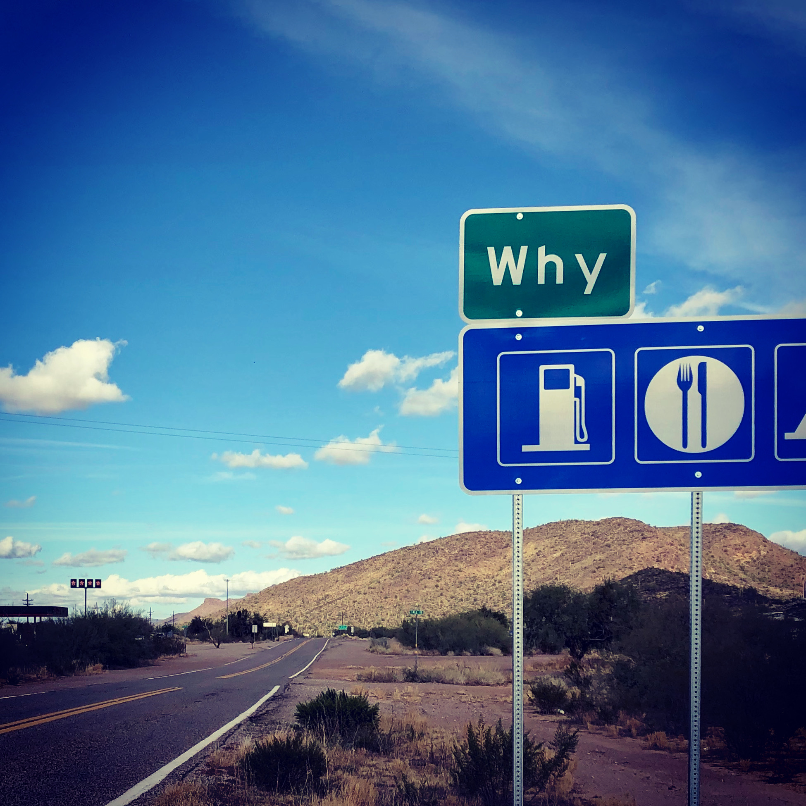

---
layout:
  title:
    visible: true
  description:
    visible: false
  tableOfContents:
    visible: true
  outline:
    visible: true
  pagination:
    visible: true
---

# Afterword

<figure><figcaption>
Life, liberty, and the pursuit of... "Why"
</figcaption></figure>

***

I started writing this book for personal reasons, as I have explained at the beginning of the book.

But while doing research for the book, I came across many interesting quotes from well-known people expressing thoughts very similar to mine. One of my favorites is the following quote by Arthur C. Clarke:

> _“Perhaps it is better to be un-sane and happy, than sane and un-happy. But it is the best of all to be sane and happy. Whether our descendants can achieve that goal will be the greatest challenge of the future. Indeed, it may well decide whether we have any future.”_
>
> **― Arthur C. Clarke, British science fiction writer, in “3001: A Space Odyssey”**

Arthur C. Clarke is one of my favorite sci-fi writers. It was his writing that instilled in me the love and respect for the "hard" in "hard sci-fi". He conjures up amazing visions, scenes and plots while staying within the bounds of the known laws of nature and what is realistically possible.

Maybe it was his writing that made me subconsciously realize that one can experience all the awe and magic of science fiction without having to go too far out on a limb trying to imagine fictitious worlds with superhuman beings and impossible technologies.

That realization, possibly coupled with the number of times I had my mind blown while reading about some scientific fact or some technological advance or another contributed to my belief that there was no need to take leaps of faith in order to experience magic and wonder in our lives. The real universe, as it exists, is already more than sufficient for that purpose.

In fact, it was Arthur C. Clarke who said "Any sufficiently advanced technology is indistinguishable from magic." I would actually go one step further and say that all our so-called advanced technologies absolutely pale in comparison to some of the existing natural phenomena, and thus, are even more magical. We have gone over many of these phenomena in this book.

Still, I have a nit to pick about the quote included above though. I really wish the author had chosen some other words than sane / un-sane. It conveys a sense that people who believe in religion are somehow not sane.

I believe that both religions and science are after the same things: A better understanding of our reality and finding meaning, purpose and hope in it. And there is nothing un-sane about that.

Moreover, there is no correlation between sanity and belief in either religion or science, and, unfortunately, we have seen too many examples of both. Both religious and science-minded people are capable of being quite sane as well as insane.

I don't really like to take part in the religion vs science debate, because the debaters often fall prey to zealotry, which is the real insanity. If one thinks hard about it, zealotry starts to look both unscientific as well as irreligious. And I also believe that one should be free to honestly decide which way they want to go, and change their mind as many times as they want to.

But it’s not just that.

Ultimately, the truth is that there is only one Ultimate Reality.

Fortunately or unfortunately, this Ultimate Reality keeps eluding us in spite of our relentless efforts trying to figure it out, from many directions.

While we might occasionally be able to vaguely sense its outlines, we are not really able to understand it or capture it fully in terms of human thought. Or even intuitions or feelings, for that matter.

It seems to be beyond that.

This reminds me of another one of my favorite quotes:

> _"Out beyond ideas of wrongdoing and rightdoing,_
>
> _There is a field. I’ll meet you there._"
>
> **― Rumi, a 13th century Persian poet**&#x20;

Here, Rumi is supposedly talking about love, which, in his opinion, is the Ultimate Reality.&#x20;

\[ Scientists would probably agree with him on the "field" part - as in quantum fields of course. As far as we understand today, reality is ultimately a quantum field. Sorry, I couldn't help myself from cracking another bad joke. But I'm just trying to find some common ground, right? ]

Irrespective of whether we think of love or knowledge as being the Ultimate Reality, when we plumb its depths, we can sense that there is a field beyond the reach of not just numbers, but also words and even feelings or intuition.

Poets may be able to claim that they are already there, but rational knowledge-seekers such as myself need proof. And we have none. (Neither do poets, to be sure. But no one holds them to the same standard that they do the rational knowledge-seekers.)

Irrespective of that, the fact that we aren't able to reach this field doesn’t mean either of our struggles are meaningless.&#x20;

To the contrary, this struggle itself may be the essence of life. We can argue that our inherent desire for meaning is really this struggle to capture some aspect of the Ultimate Reality.

And, as we have seen in this book, this is not just a poetic or religious thought. It is a scientifically explainable process. We know that all living entities must perform Active Inference in order to continue to exist in a dynamic environment, which involves building an incrementally better model of Ultimate Reality.

What is truly incredible is that even as hard-headed followers of evidence and reason, we have been successful in capturing at least some aspects of this field beyond all fields. We didn't have to resort to taking leaps of faith to do so. And we are humble enough to accept that we may not have captured all of it, but we do have some reliable methods to keep capturing more.

And, by saying that, I am not trying to suggest that the approach of evidence and reason is superior to any other. I am only trying to fight the pervasive dogma that things like meaning, purpose and hope can only be captured via poetry or faith.

The less traveled path of evidence and reason has been denied access to the big table of meaning, purpose and hope that faith and poetry have occupied for a long time. While this might have been ok in the past because we didn't really know a lot of the things we know today, I believe the now time has come for this approach to get a seat at the same table.

Here is how the concept of meaning can evolve as one gets further and further along the path of evidence and reason.

For example, someone might say, looking at the smiling face of their child is all the truth and meaning they need in their life.

Others might go a little deeper and say, the love, hope and wonder they see in the child’s smiling face is all the truth and meaning they need in their life.

Others might go even deeper and say, seeing the love, hope and wonder in the eyes of a child makes them feel that they are in the presence of a supernatural power (or Love itself, as Rumi might have said). And that is all the truth and meaning they need in their life.

Still others, who go deeper might say, seeing the love and hope in a child’s eyes reminds them of how unimaginably improbable and unbelievably complex this seemingly simple and commonplace event is.&#x20;

Right here and right now, Ultimate Reality is somehow creating particles out of quantum fog, atoms and molecules out of particles, mind-bogglingly complex living cells out of those atoms and molecules, entire smiling children out of those cells, and ultimately the mysterious phenomenon of consciousness, in both you and the child, that allows both of you to experience this magical moment together.

Just close your eyes and imagine what is going on inside the child’s or even your own body. Trillions of self-organized cells containing complex structures and processes that are many orders of magnitude higher than the most advanced technology we have built so far. All of them are simply going about their business, building and dismantling structures, moving things around, acquiring and consuming sources of energy and other resources, hunting down parasites, repairing themselves when needed, communicating with each other using electrical and chemical signals, growing and dividing, ultimately giving rise to the feeling that there is a “you” inside of you and there is a “reality” that you are a part of, and you get to experience all of this just by being present.

Not only that, but today it is possible for us to come up with explanations for the vast majority of this phenomenon, from the ground up, in all its glory.&#x20;

Moreover, you can gather an overwhelming amount of evidence that there appears to be an inherent direction to all of it. You and every other part of the universe are on an amazing journey in that direction, even if you are completely unaware of it.

This journey has been going on for billions of years, and as far as we can predict, will continue for billions more.

Knowing all of this, how it came about, and the fact that we have been able to discover so much of it all by ourselves from this tiny corner of the universe gives me a far more satisfying feeling of meaning, purpose and hope in my life than anything else I have ever encountered.

Still, trying to convince you that any of these approaches or perspectives or levels is better or worse than others is not the point of this book.

This book is only trying to make the point that it is absolutely possible to find meaning, purpose and hope in our lives even if we take the relatively less traveled path of evidence and reason. With that knowledge, one can confidently pull their chair up to the big "meaning table" and party along with all the other perspectives.

When one looks at what makes us uniquely human, as compared to all other animals or even other apes, we usually point to our big and complex brains. A few may point to our opposable thumbs, or our upright posture, or our mostly hairless bodies.

But I think one of our most interesting features is that we are born totally helpless and helplessly cute, which means we are cared for by willing adults for a long time. Most other animals become independent comparatively quite quickly after being born, but we take years. And we keep maturing well past adulthood (or even midlife, for that matter!)

I believe that this long period of ignorance of and helplessness about our reality leads to some unique, deep and lifelong side effects.

As a result of this long period of nurture, for all our talk of our god-given birthright to freedom and liberty, we seem to have real difficulty walking that talk in our lives.

Ever since our childhood, we are used to looking for help and guidance. In the beginning we look to our parents, then add teachers, and then maybe a boss, or influencers or leaders of some type, or maybe some ideology.

Our desire for meaning and purpose is probably just a generalization of this need for guidance. Our desire for hope may just be a need for the reassurance we felt as children when adults took care of us.

A lucky few, such as myself, get an opportunity to have a midlife crisis, when they get to ask who they should really look to for guidance. And even fewer ones get to ask why.

And what's even more fortunate is that we are finally at a point in our scientific and technological development where we can start to piece together answers to these questions.

We can answer the first question, about who we should look to for guidance, with: The universe itself.

And the second one, why we should look to the universe for guidance, with: The overwhelming amount of evidence of the ubiquitous and omnipresent tendencies of the universe, that gave birth to you, and that you embody yourself.

Of course, with the approach we have taken in this book, we may not have perfect and final answers, but we have good enough answers, have sufficient reason to believe that they are better than many other answers, and ways of improving them even more as we learn more.

I am going to close by quoting from the Upanishads, which are some of the oldest recorded human thoughts and capture the feeling perfectly:

> _“ॐ असतो मा सद्गमय ।_
>
> _तमसो मा ज्योतिर्गमय ।_
>
> _मृत्योर्मा अमृतं गमय ।_
>
> _ॐ शान्तिः शान्तिः शान्तिः ॥”_
>
> _“Lead me from ignorance to the truth,_
>
> _Lead me from darkness to light,_
>
> _Lead me from death to immortality,_
>
> _Peace, peace, peace.”_
>
> **― Pavamana Mantra, an Ancient Vedic chant**

Thank you for your time and attention.

